# 네트워크 트래픽 전송 장애 분석 보고서

## 1. 서론
### 1.1. 과제 개요
본 보고서는 "네트워크 트래픽 전송 장애 원인 분석"에 대한 문제 해결 과정을 담고 있다. 주어진 `Pro_01.pkt` 실습 파일을 기반으로, **PC_A (IP: 192.168.1.10)에서 PC_C (IP: 192.168.5.10)**로의 통신 장애 원인을 파악하고, 이에 대한 해결 방안을 제시하여 문제를 해결하는 것이 본 과제의 목표이다.
### 1.2. 문제 상황
초기 `ping` 테스트 결과, PC_A에서 PC_C로의 네트워크 트래픽이 정상적으로 전송되지 않음을 확인했다. 이는 네트워크 경로상의 어딘가에 문제가 있음을 시사한다.


## 2. 문제 발견 과정
PC_A와 PC_C 간의 통신 장애 원인을 체계적으로 파악하기 위해 다음 단계를 거쳐 네트워크 구성 요소들을 점검했다.

### 2.1. 초기 통신 테스트 및 증상 확인
PC_A의 Command Prompt에서 PC_C로의 ping을 시도했다.

- **명령어** : `ping 192.168.5.10`
- **결과** : `Request timed out`. 또는 `Destination Host Unreachable`. 메시지가 반복적으로 나타났으며, 이는 PC_A와 PC_C 간의 통신이 불가능함을 명확히 보여주었다.

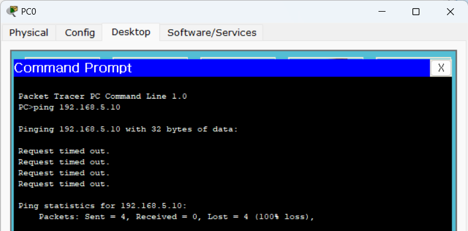

### 2.2. PC별 TCP/IP 설정 확인
`ipconfig` 명령어를 사용하여 각 PC의 네트워크 설정을 확인했다.
- **PC_A 설정 확인**
    - **명령어** : `ipconfig /all`
    - **결과** : IP 주소 (192.168.1.10), 서브넷 마스크 (255.255.255.0), 기본 게이트웨이 (192.168.1.254)가 모두 올바르게 설정되어 있음을 확인했다.

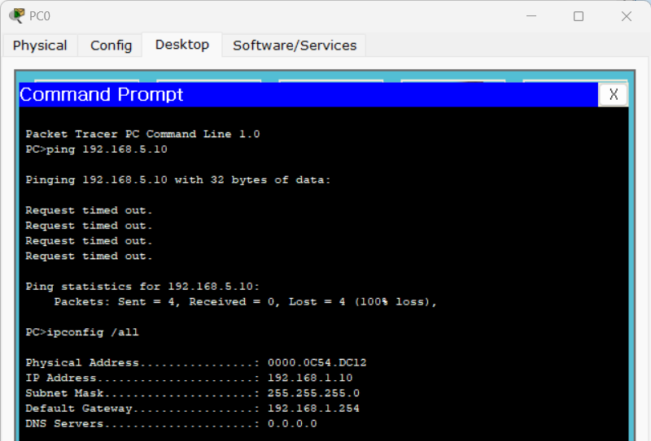

- **PC_C 설정 확인**
    - **명령어** : `ipconfig /all`
    - **결과** : IP 주소 (192.168.5.10)와 서브넷 마스크 (255.255.255.0)는 올바르게 설정되어 있었으나, 기본 게이트웨이 주소가 192.168.3.2로 잘못 설정되어 있음을 발견했다. (올바른 게이트웨이는 PC_C 네트워크의 라우터 인터페이스 주소인 192.168.5.254여야 함)

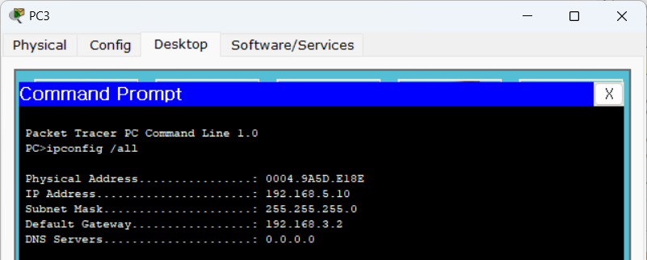

- **1차 문제점** : PC_C의 기본 게이트웨이 설정 오류.

### 2.3. 통신 경로 추적 (Traceroute)
PC_A에서 PC_C까지의 패킷 경로를 확인하기 위해 `tracert` 명령어를 사용했다.
- **명령어** : `tracert 192.168.5.10`
- **결과**

```
Tracing route to 192.168.5.10 over a maximum of 30 hops: 
1       xx ms     xx ms     xx ms       192.168.1.254
2       *           *         *       Request timed out.
```

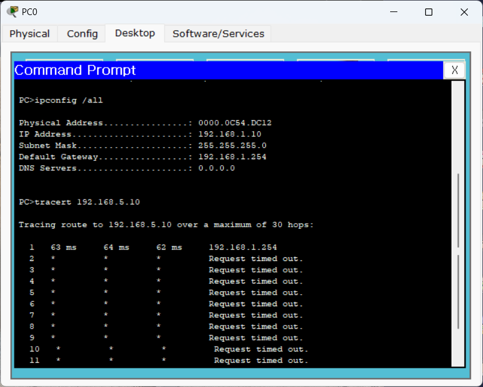

- **분석** : 패킷이 PC_A의 게이트웨이(192.168.1.254)까지는 도달했으나, 그 다음 홉에서 손실됨을 확인했다. 이는 PC_A가 연결된 라우터(R1)가 목적지 네트워크(192.168.5.0/24)로 가는 경로 정보를 제대로 가지고 있지 않거나 잘못된 정보를 가지고 있음을 의미한다.

### 2.4. 라우터 라우팅 테이블 분석 (R1 - PC_A 게이트웨이 라우터)
PC_A의 기본 게이트웨이 역할을 하는 라우터(R1)의 라우팅 테이블을 show ip route 명령어로 확인했다.

- **명령어** : `show ip route` (R1에서 실행)
- **결과**

```
Gateway of last resort is not set

C    192.168.1.0/24 is directly connected, FastEthernet0/0
C    192.168.3.0/24 is directly connected, Serial0/0
S    192.168.5.0/24 is directly connected, Serial0/0
```

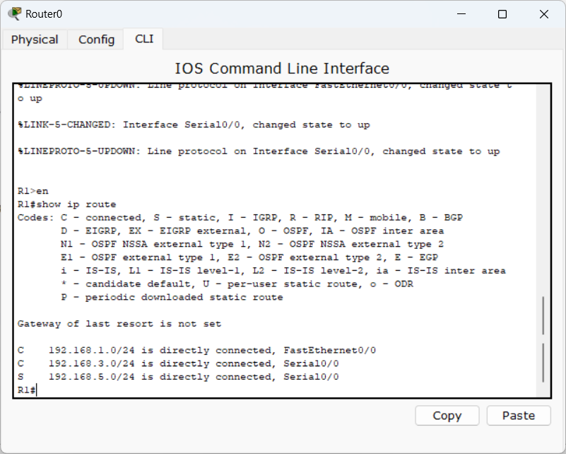

- **2차 문제점** : `S 192.168.5.0/24 is directly connected, Serial0/0` 정적 경로가 잘못 설정되어 있음을 발견했다. R1은 192.168.5.0/24 네트워크가 자신의 Serial0/0 인터페이스에 직접 연결되어 있다고 인식하고 있었으나, 실제로는 192.168.3.0/24 네트워크를 통해 다른 라우터(R2)를 거쳐야 도달하는 원격 네트워크이다. 이러한 잘못된 설정으로 인해 패킷이 올바른 다음 홉으로 전달되지 못하고 있었다.

### 2.5. 라우터 라우팅 테이블 분석 (R2 - PC_C 게이트웨이 라우터)
PC_C의 기본 게이트웨이 역할을 하는 라우터(R2)의 라우팅 테이블을 show ip route 명령어로 확인했다.

- **명령어** : show ip route (R2에서 실행)
- **결과**

```
Gateway of last resort is not set

S    192.168.1.0/24 is directly connected, FastEthernet0/0
C    192.168.3.0/24 is directly connected, Serial0/1
C    192.168.5.0/24 is directly connected, FastEthernet0/0
```

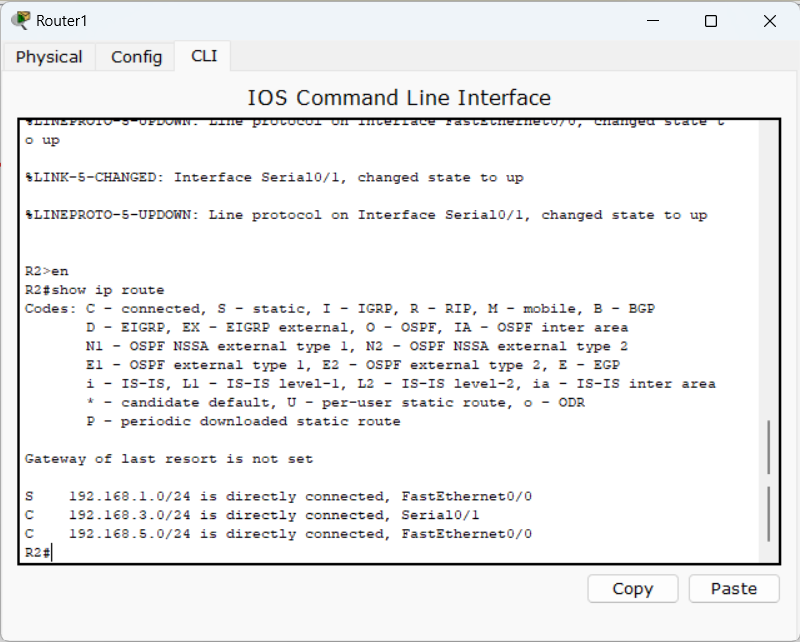

- **3차 문제점** : `S 192.168.1.0/24 is directly connected, FastEthernet0/0` 정적 경로가 잘못 설정되어 있음을 발견했다. R2는 192.168.1.0/24 네트워크가 자신의 FastEthernet0/0 인터페이스에 직접 연결되어 있다고 인식하고 있었으나, 실제로는 192.168.3.0/24 네트워크를 통해 R1을 거쳐야 도달하는 원격 네트워크이다. 이는 R1의 문제점과 유사하게, 돌아오는 경로에서 패킷이 손실되는 원인이 된다.

## 3. 문제 해결 과정 및 해결 방안
발견된 세 가지 주요 문제점들을 다음 단계에 따라 수정하여 통신 장애를 해결했다.

### 3.1. PC_C 기본 게이트웨이 주소 수정
**해결 방안** : PC_C의 IP Configuration 설정으로 이동하여 **Default Gateway 주소를 192.168.3.2**에서 올바른 값인 192.168.5.254로 변경했다.

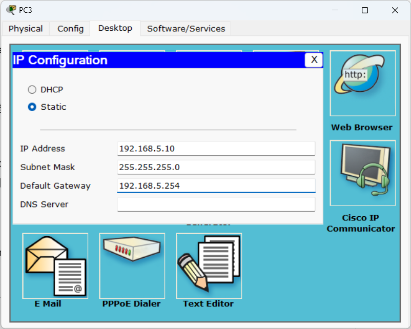

### 3.2. R1 라우팅 테이블 수정 (PC_C 네트워크 경로)
**해결 방안** : R1에 설정된 잘못된 정적 경로를 제거하고, PC_C 네트워크 (192.168.5.0/24)로의 올바른 정적 경로를 다음 홉(Next Hop) IP 주소를 명시하여 추가했다. R1과 R2를 연결하는 192.168.3.0/24 네트워크 상에서 R2의 Serial 인터페이스 IP 주소인 192.168.3.2를 다음 홉으로 지정했다.

```
R1# configure terminal
R1(config)# no ip route 192.168.5.0 255.255.255.0 Serial0/0
R1(config)# ip route 192.168.5.0 255.255.255.0 192.168.3.2
R1(config)# end
R1# write memory
```

**수정 후 R1 라우팅 테이블**

```
S    192.168.5.0/24 [1/0] via 192.168.3.2
```

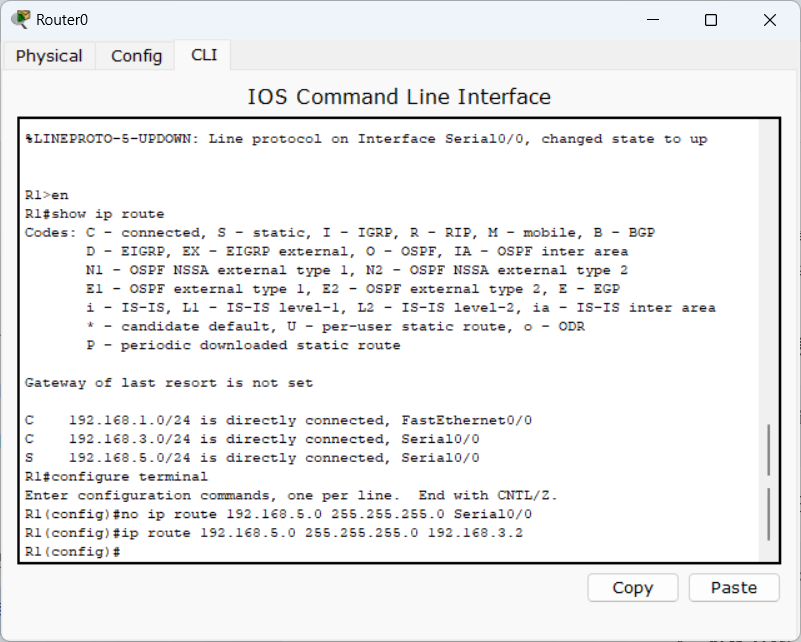

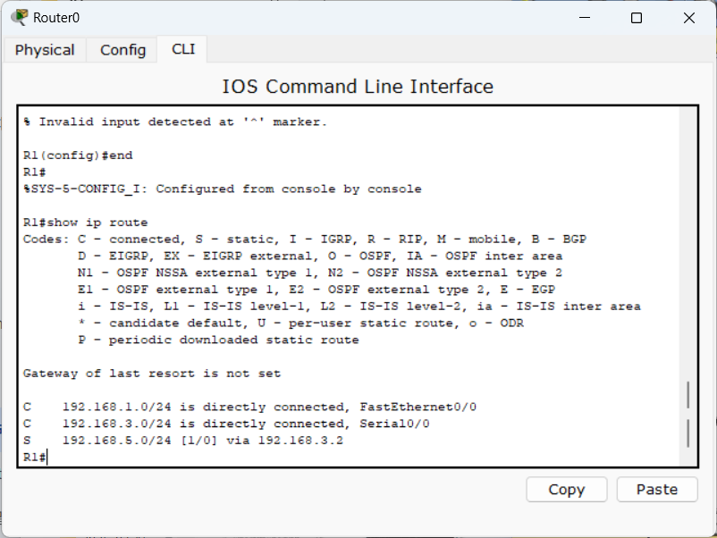

### 3.3. R2 라우팅 테이블 수정 (PC_A 네트워크 경로)
- **해결 방안** : R2에 설정된 잘못된 정적 경로를 제거하고, PC_A 네트워크 (192.168.1.0/24)로의 올바른 정적 경로를 **다음 홉(Next Hop) IP 주소**를 명시하여 추가했다. R1과 R2를 연결하는 192.168.3.0/24 네트워크 상에서 R1의 Serial 인터페이스 IP 주소인 **192.168.3.1** (예상되는 R1의 시리얼 인터페이스 주소)를 다음 홉으로 지정했다.

```
R2# configure terminal
R2(config)# no ip route 192.168.1.0 255.255.255.0 FastEthernet0/0
R2(config)# ip route 192.168.1.0 255.255.255.0 192.168.3.1
R2(config)# end
R2# write memory
```

**수정 후 R2 라우팅 테이블**

```
S    192.168.1.0/24 [1/0] via 192.168.3.1
```

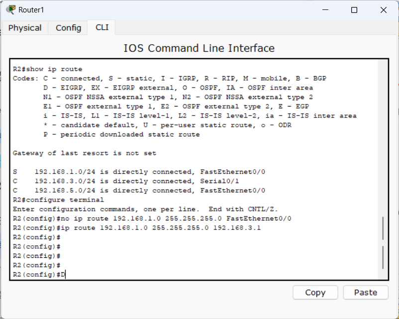

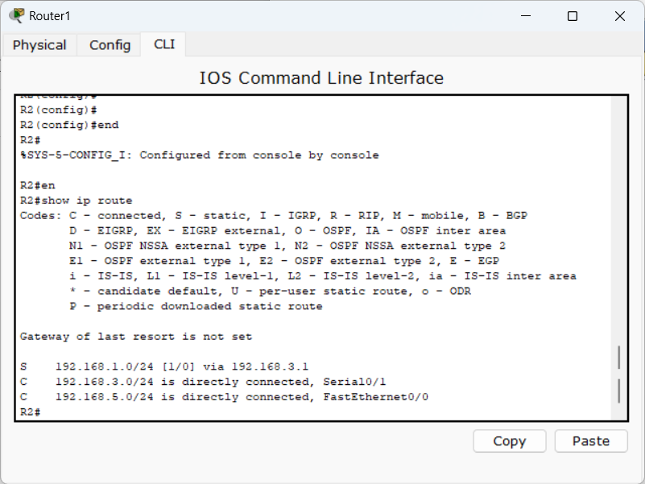

## 4. 해결 결과 및 결론
모든 문제점을 해결한 후, PC_A에서 PC_C로의 ping 명령을 다시 시도하여 통신 성공 여부를 확인했다.

- **명령어** : `ping 192.168.5.10` (PC_A에서 실행)
- **결과**

```
Pinging 192.168.5.10 with 32 bytes of data:

Reply from 192.168.5.10: bytes=32 time=157ms TTL=126
Reply from 192.168.5.10: bytes=32 time=141ms TTL=126
Reply from 192.168.5.10: bytes=32 time=157ms TTL=126
Reply from 192.168.5.10: bytes=32 time=158ms TTL=126

Ping statistics for 192.168.5.10:
    Packets: Sent = 4, Received = 4, Lost = 0 (0% loss),
Approximate round trip times in milli-seconds:
    Minimum = 141ms, Maximum = 158ms, Average = 153ms
```

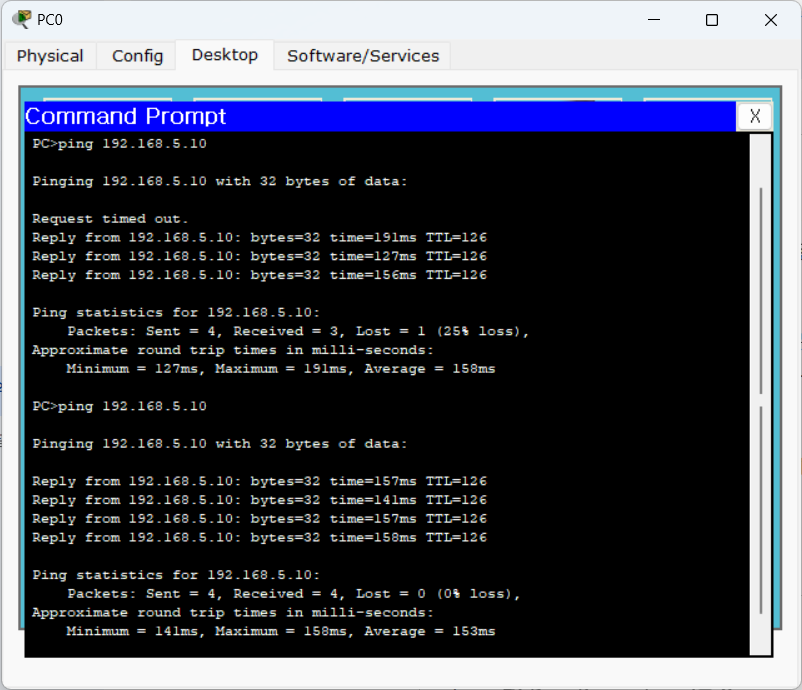

위 결과를 통해 4개의 패킷이 모두 성공적으로 전송되고 수신되었으며, 패킷 손실률이 0%임을 확인했다. 이는 PC_A와 PC_C 간의 네트워크 트래픽 전송 장애가 완전히 해결되었음을 의미한다.

결론적으로, 본 과제를 통해 네트워크 통신 장애의 주요 원인이 잘못된 호스트 게이트웨이 설정과 라우터의 부적절한 라우팅 테이블 설정(특히 잘못된 정적 라우팅)임을 확인했으며, 이를 올바르게 수정함으로써 문제를 성공적으로 해결할 수 있었다.