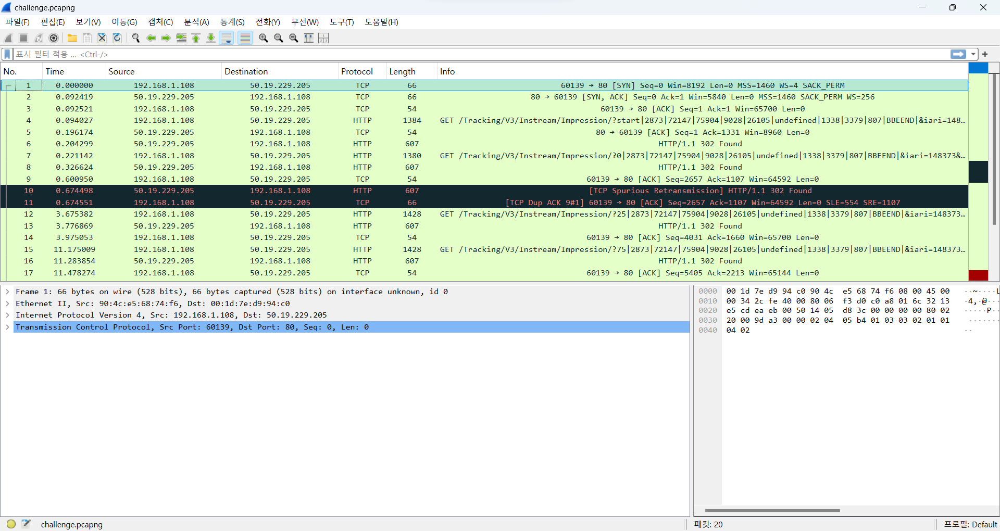
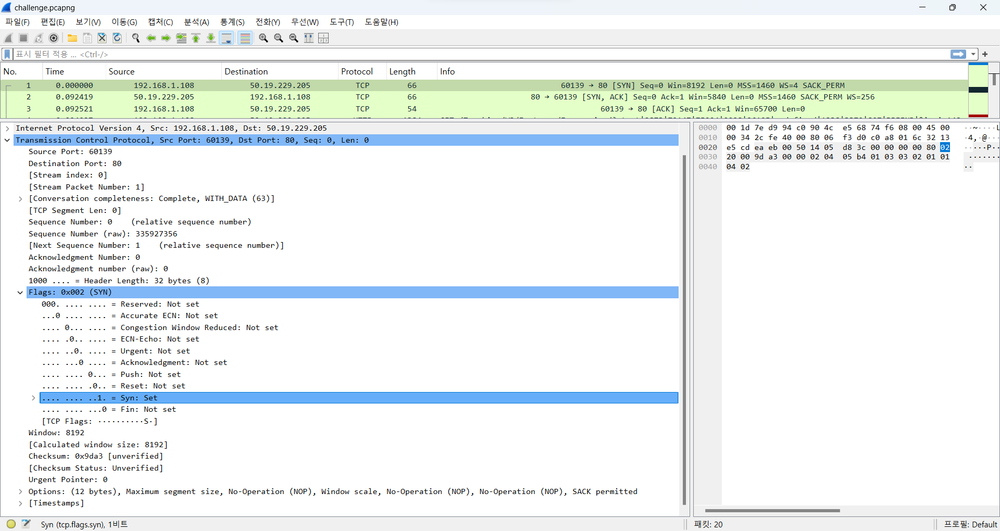
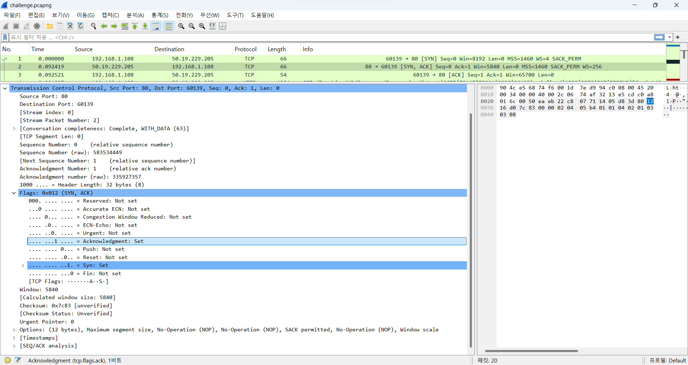
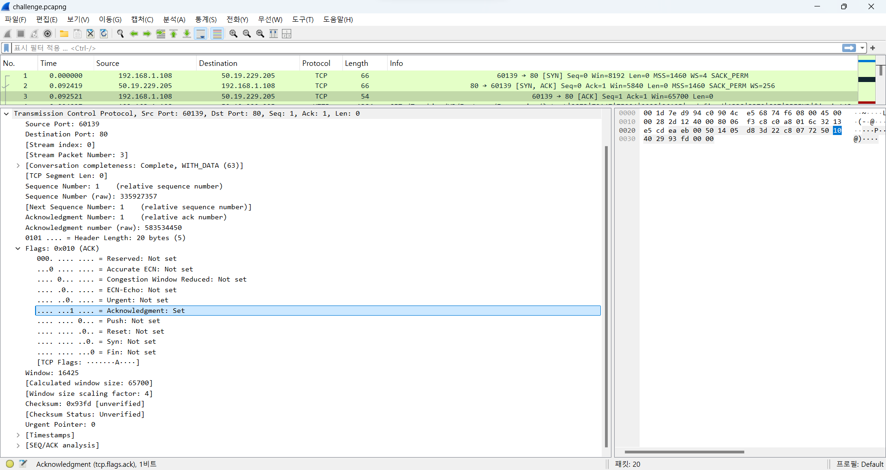
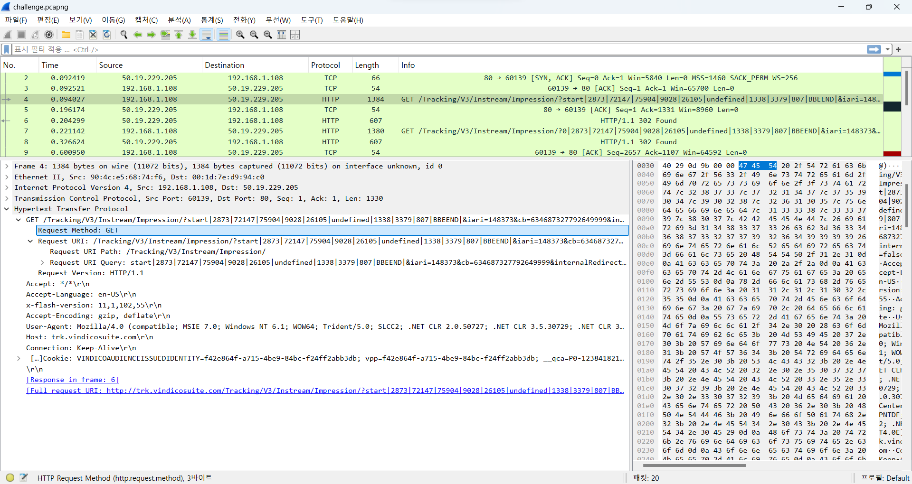
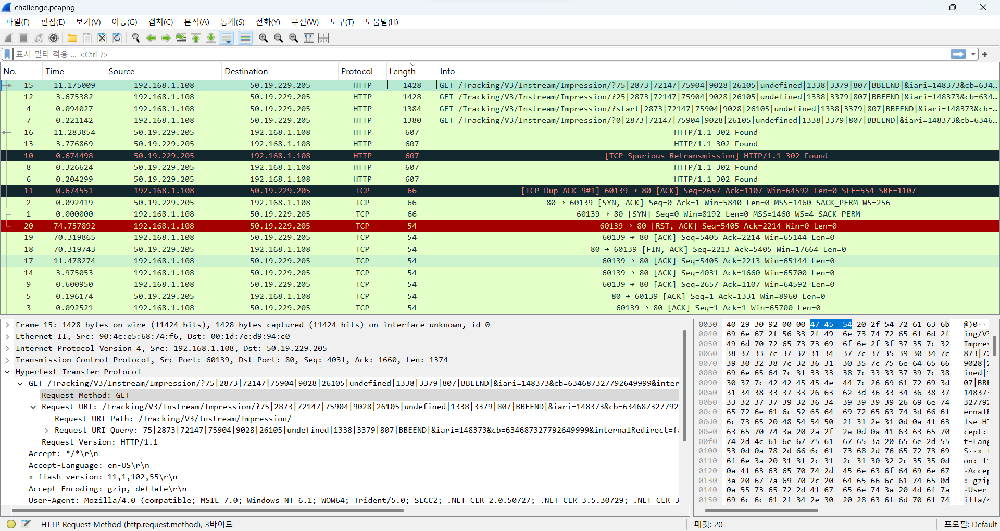
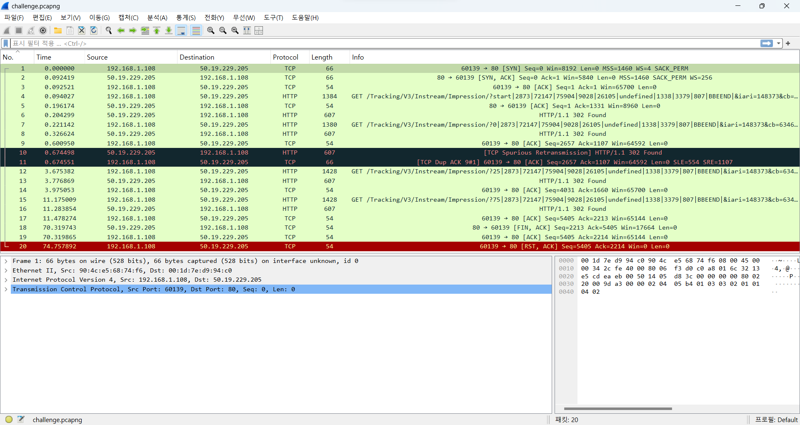
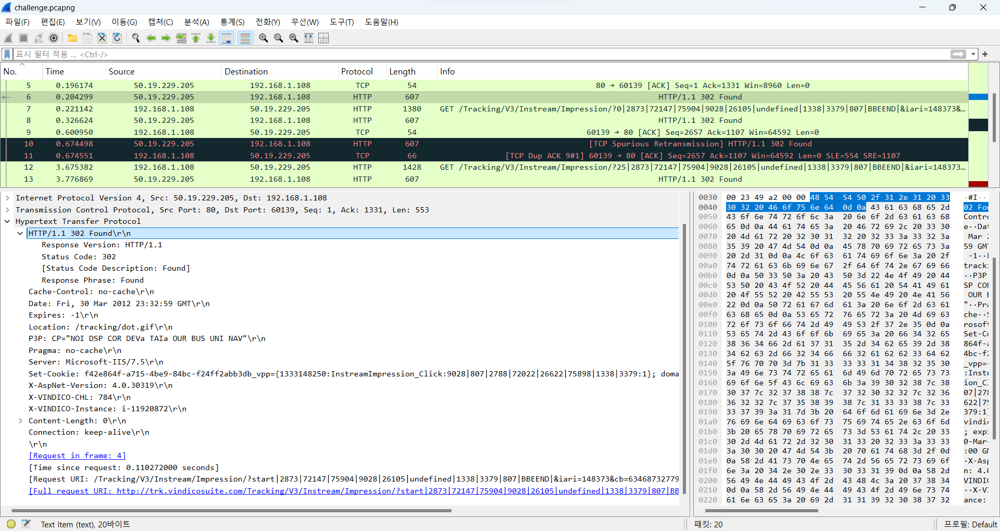
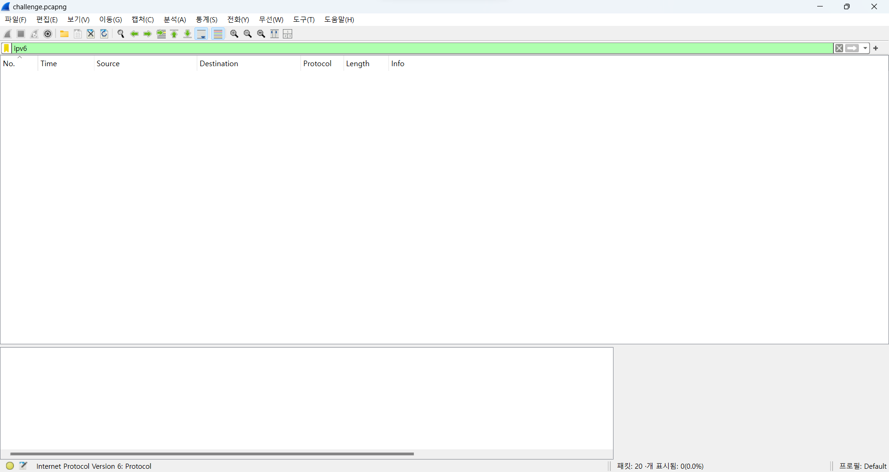

# 패킷 추적 파일을 통한 네트워크 이벤트 분석 보고서

## 1. 서론
### 1.1. 과제 개요
본 보고서는 "패킷 추적 파일을 통한 네트워크 이벤트 분석"에 대한 내용을 담고 있다. 주어진 `challenge.pcapng` 추적 파일을 Wireshark를 기반으로 분석하여, 해당 파일 내에서 발생한 주요 네트워크 이벤트와 통신 흐름을 파악하는 것이 본 과제의 목표이다.
### 1.2. 문제 상황
특정 시간대에 수집된 `challenge.pcapng` 파일을 분석하여 파일 내의 패킷 수, TCP/HTTP 통신 흐름, 프로토콜 종류 등 핵심 네트워크 이벤트를 식별해야 했다.

### 2. 문제 분석 및 답변
### 2.1. 질문 1: 이 추적 파일에는 얼마나 많은 패킷이 있는가?
- **분석** : 제공된 텍스트 데이터의 마지막 번호와 Wireshark 화면 우측 하단에 표시된 패킷 수로 총 **20개**의 패킷이 있음을 확인했다. 이를 통해 전체 통신량의 대략적인 규모를 짐작할 수 있었다.
- **답변** : 이 추적 파일에는 총 **20개**의 패킷이 있다.

### 2.2. 질문 2: IP 호스트는 무엇으로 프레임 1, 2, 3 안에서 TCP 연결을 만드는가?
- **분석**
    - 프레임 1: `192.168.1.108` → `50.19.229.205` [SYN] (클라이언트의 연결 요청)
        - Source Port: 60139, Destination Port: 80
    - 프레임 2: `50.19.229.205` → `192.168.1.108` [SYN, ACK] (서버의 응답)
        - Source Port: 80, Destination Port: 60139
    - 프레임 3: `192.168.1.108` → `50.19.229.205` [ACK] (클라이언트의 최종 확인)
        - Source Port: 60139, Destination Port: 80

- **해석** : 분석 결과 ``192.168.1.108``이 ``50.19.229.205``로 향하는 TCP 연결을 시작했음을 알 수 있었다. `Flag` 필드를 확인하여 이 연결은 TCP의 **3-way handshake 과정(SYN, SYN-ACK, ACK)**을 통해 이루어졌음도 알 수 있었다. 특히, ``192.168.1.108``은 임시 포트(`60139`)를 사용하여 서버의 잘 알려진 HTTP 포트(`80`)로 연결을 시도했다. 이는 클라이언트가 웹 서버에 HTTP 통신을 위한 세션을 설정하는 과정이며, 안정적인 데이터 통신을 위한 기반을 마련한다.
- **답변** : 프레임 1, 2, 3에서 TCP 연결을 만드는 IP 호스트는 `192.168.1.108`이며, 이는 **TCP 3-way handshake** 방식을 통해 Source Port `60139`에서 Destination Port `80`으로 연결을 수립했다.

### 2.3. 질문 3: 프레임 4로 보낸 HTTP 명령어는 무엇인가?
- **분석** : 프레임 4의 Packet Details 부분을 확인하여 `GET` HTTP 명령어를 사용했음을 확인했다. `GET` HTTP 명령어가 사용되었다는 것은 클라이언트(`192.168.1.108`)가 서버(`50.19.229.205`)로부터 특정 리소스(여기서는 `/Tracking/V3/Instream/Impression/...` 경로)를 요청하고 있음을 의미한다. 찾아보니 URL 경로(`Tracking/V3/Instream/Impression`)가 비디오 광고 서비스와 관련된 요청임을 알 수 있었다.

- **답변** : 프레임 4로 보낸 HTTP 명령어는 `GET`이다.

### 2.4. 질문 4: 이 추적 파일 안에서 가장 긴 프레임 길이는 얼마인가?
- **분석** : 각 프레임의 Len (Length) 필드를 내림차순으로 정렬하여 가장 큰 값을 찾을 수 있었다.
    - 프레임 15: 1428 바이트
    - 프레임 12: 1428 바이트
    - 프레임 7: 1380 바이트
    - 프레임 4: 1384 바이트
    - 가장 긴 프레임 길이가 1428 바이트라는 것을 통해 해당 네트워크의 **MTU(Maximum Transmission Unit)**가 최소 1428 바이트 이상임을 예상할 수 있다. 실제로 이더넷의 표준 MTU는 1500바이트이므로, 이 길이는 정상적인 범위 내에 있다고 볼 수 있다.

- **답변** : 이 추적 파일 안에서 가장 긴 프레임 길이는 **1428 바이트**이다.

### 2.5. 질문 5: 어떤 프로토콜이 protocol 열에 보이는가?
- **분석** : 제공된 패킷 목록의 네 번째 열인 Protocol 열에 나타나는 프로토콜 이름들을 확인했다. 캡처 파일에서 **TCP**와 **HTTP** 프로토콜이 주로 보였으며, TCP는 데이터의 신뢰성 있는 전송을 보장하는 전송 계층 프로토콜이며, HTTP는 웹 콘텐츠 교환에 사용되는 애플리케이션 계층 프로토콜이다. 이는 **클라이언트-서버 웹 서비스**가 작동하고 있음을 나타낸다.

- **답변** : Protocol 열에 보이는 프로토콜은 주로 **TCP와 HTTP**이다.

### 2.6. 질문 6: HTTP 서버가 보낸 응답은 무엇인가?
- **분석** : HTTP 요청(`GET` 명령어)에 대한 서버(`50.19.229.205`)의 응답 패킷을 찾아 `HTTP/1.1` 뒤에 오는 상태 코드와 메시지를 확인했다.
    - 프레임 6: HTTP/1.1 302 Found
    - 프레임 8: HTTP/1.1 302 Found
    - 프레임 10: HTTP/1.1 302 Found **([TCP Spurious Retransmission] 경고 포함)**
    - 프레임 13: HTTP/1.1 302 Found
    - 프레임 16: HTTP/1.1 302 Found

- **해석**
    - **HTTP 302 Found 응답** : 이 상태 코드는 서버가 요청된 리소스를 일시적으로 다른 URI에서 찾았음을 나타낸다. 즉, 서버는 클라이언트에게 현재 요청한 페이지/리소스 대신 `Location` 헤더에 명시된 다른 URL로 **리다이렉션**을 보내라고 지시하는 것이다. 이는 `301 Moved Permanently(영구 이동)`와 달리 일시적인 변경을 의미하며, 주로 서버 유지보수, A/B 테스트, 또는 특정 조건에 따른 동적 페이지 이동 등에 사용된다고 한다.
    - **반복적인 302 응답** : 캡처 파일에서 여러 번의 `GET` 요청마다 반복적으로 `302 Found` 응답이 나타나는 것은, 클라이언트가 특정 기능을 수행하기 위해 여러 단계의 리다이렉션을 거쳐야 하는 상황임을 뜻한다. 특히 URL 경로에 "Tracking"이 포함되어 있는 것으로 보아, 이는 온라인 광고 추적 시스템에서 흔히 발생할 수 있는 상황인 것 같다고 생각된다. 사용자가 광고를 클릭하면, 여러 광고 플랫폼이나 측정 시스템을 거치며 연속적인 리다이렉션이 발생하고, 최종적으로 목표 페이지에 도달하게 되는 과정일 수 있다. 이러한 다단계 리다이렉션은 광고 성과 측정, 사용자 행동 분석 등을 위해 사용된다.
    - **프레임 10의 [TCP Spurious Retransmission]** : 이 표시는 **"가짜 재전송" 또는 "불필요한 재전송"**을 의미한다. TCP는 데이터 손실을 감지하면 해당 데이터를 재전송하는데, `Spurious Retransmission`은 실제로는 데이터 손실이 발생하지 않았거나, 이미 수신 측에서 해당 데이터의 `ACK`를 보냈음에도 불구하고, 송신 측에서 타이머 만료 등으로 인해 데이터를 다시 보낸 경우에 Wireshark가 표시하는 경고이다.
    - 이는 일반적으로 네트워크 지연(Latency), 패킷 순서 바뀜(Out-of-Order delivery), 또는 송수신 버퍼 크기 문제 등으로 인해 발생할 수 있다. 즉, 송신 측(`50.19.229.205`)이 수신 측(`192.168.1.108`)으로부터 제때 ACK를 받지 못해 재전송을 결정했지만, 실제로는 ACK가 도중에 지연되거나 패킷 순서가 바뀌어 도착했을 가능성이 있다. 이는 네트워크의 안정성이나 성능 문제를 간접적으로 시사할 수 있으며, 특히 웹 서비스의 경우 사용자 경험에 미미한 지연을 줄 수 있다.
- **답변** : HTTP 서버(`50.19.229.205`)가 보낸 응답은 `HTTP/1.1 302 Found` 이다. 이 응답은 클라이언트에게 리소스를 다른 위치에서 찾았으니 **새로운 URL로 다시 요청(리다이렉션)**하라는 지시이다. 이 추적 파일에서는 여러 번의 HTTP 요청에 대해 이 302 응답이 반복적으로 나타나며, 이는 다단계의 리다이렉션 체인이 작동하고 있음을 추측할 수 있다. 또한, 프레임 10에서 보이는 **[TCP Spurious Retransmission]**은 서버가 데이터를 불필요하게 재전송했음을 나타내며, 이는 네트워크 지연이나 패킷 순서 변경 등 작은 네트워크 문제의 징후일 수 있다.

### 2.7. 질문 7: 이 추적 파일 안에 IPv6 트래픽이 있는가?
- **분석** : 패킷 필터링(`ipv6`)을 통해 IPv6 트래픽이 존재하는지 확인해보았는데 빈 화면으로 나왔다. 이 캡처 파일에 IPv6 트래픽이 없다는 것은 통신이 전부 IPv4 환경에서 이루어졌음을 아 나타낸다. 이를 통해 해당 네트워크 환경이 IPv4만 사용하거나, 적어도 캡처된 트래픽에서는 IPv6 통신이 발생하지 않았음을 알 수 있다. 여전히 많은 시스템이나 특정 네트워크에서는 IPv4만 사용하는 경우가 많다는 사실도 엿볼 수 있었다.

- **답변** : 이 추적 파일 안에 IPv6 트래픽은 없다. 모든 트래픽은 **IPv4**를 사용하고 있다.

#### 2.8. 추가 분석: TCP 연결 종료 과정
- **분석**
    - 프레임 18: 50.19.229.205 → 192.168.1.108 [FIN, ACK] Seq=2213 Ack=5405
    - 프레임 19: 192.168.1.108 → 50.19.229.205 [ACK] Seq=5405 Ack=2214
    - 프레임 20: 192.168.1.108 → 50.19.229.205 [RST, ACK] Seq=5405 Ack=2214
    - 파일의 마지막 패킷들은 TCP 연결 종료 과정을 보여준다.
- **해석** : 프레임 18에서 TCP 연결 종료는 서버가 먼저 `FIN` 플래그를 보내 시작되었지만, 클라이언트는 이에 대한 **ACK**를 보낸 후 정상적인 종료 대신 `RST` 플래그로 연결을 강제 종료했다. 이는 클라이언트 측에서의 4-way handshake 과정을 거치지 않고 비정상적인 연결 종료를 했음을 의미한다.

### 3. 결론
`challenge.pcapng` 파일을 분석한 결과, 해당 패킷 캡처는 주로 **TCP** 및 **HTTP** 프로토콜을 사용한 웹 통신 이벤트의 패킷을 수집한 것임음을 확인할 수 있었다. 클라이언트(`192.168.1.108`)는 서버(`50.19.229.205`)와 TCP 연결을 성공적으로 수립한 후, `/Tracking/V3/Instream/Impression` 경로에 대한 `HTTP GET` 요청을 반복적으로 전송했다. 이에 대해 서버는 일관되게 `HTTP/1.1 302 Found`라는 리다이렉션 응답을 반환했다. 이는 광고 추적과 같이 다단계의 웹 리다이렉션이 필요한 시나리오에서 흔히 볼 수 있는 통신 패턴이다. 파일 내 가장 긴 프레임은 1428 바이트로 일반적인 이더넷 환경의 MTU에 부합하며, 모든 트래픽은 IPv4 기반으로 이루어져 IPv6 트래픽은 발견되지 않았다. 더불어, TCP 연결 종료 과정에서는 서버가 먼저 FIN 플래그를 보내 연결 종료를 요청했으나, 클라이언트가 이에 대한 ACK를 보낸 후 정상적인 `FIN` 응답 대신 `RST` 플래그를 보내 연결을 강제로 종료했음을 확인했다. 이는 클라이언트 측에서의 비정상적인 연결 종료를 시사한다. 

이러한 분석을 통해 특정 시간대의 네트워크 통신 흐름과 주요 웹 상호작용 이벤트, 그리고 연결 종료 시 발생한 비정상적인 패턴까지 명확히 이해할 수 있었다.