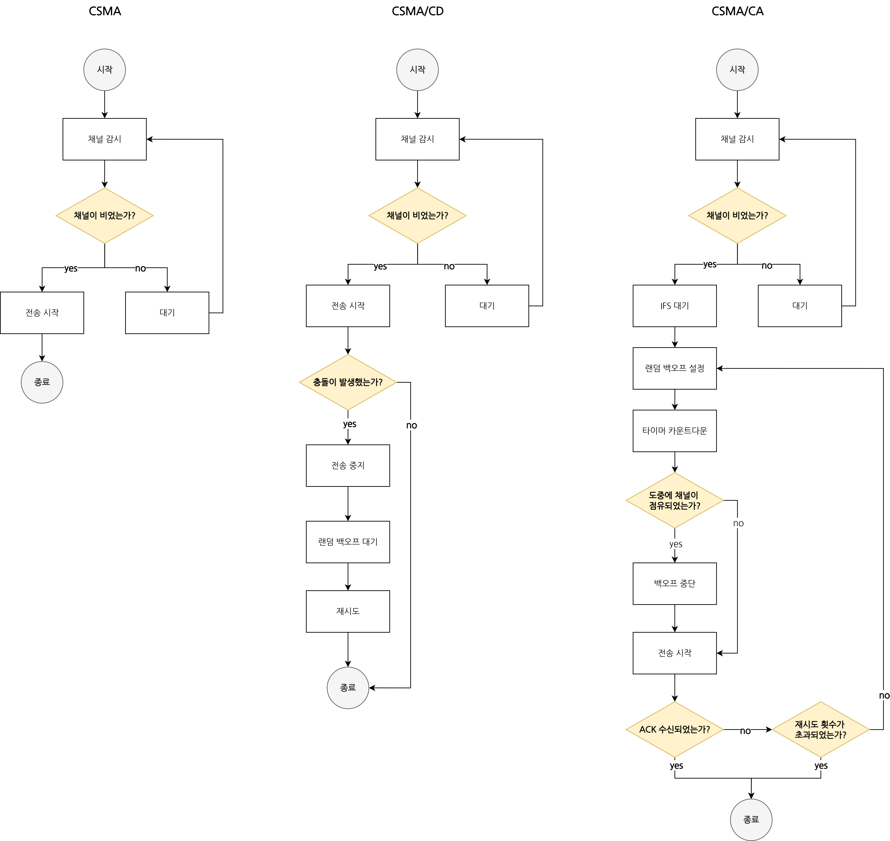

# TCP와 UDP 기반 데이터 전송 과정 및 매체접근제어 기술 비교 분석

## 1. TCP 및 UDP 기반 데이터 전송 과정 이해
### 1.1. TCP 기반 데이터 전송 과정 상세 설명
Client 정보 - IP: `192.168.3.1`, MAC: `0800:0222:2222`
Server 정보 - IP: `192.168.3.2`, MAC: `0800:0222:1111`

#### TCP 1 of 22: 애플리케이션 계층의 요청 발생

**설명** : 클라이언트 시스템의 애플리케이션(웹 브라우저, FTP 클라이언트 등)이 특정 목적지 서버(`192.168.3.2`)와 신뢰성 있는 연결을 수립하고자 한다. 애플리케이션은 이를 위해 운영체제의 네트워크 스택에 연결 요청을 전달한다. 이때, 애플리케이션은 전송 계층 프로토콜로 TCP를 사용할 것을 명시하고, TCP 계층에 `192.168.3.2`로의 세션 수립을 지시한다. TCP 계층은 다시 IP 계층에게 `192.168.3.2`로 향하는 TCP SYN(Synchronize) 패킷을 보내달라고 요청한다.
**결론** : 이는 네트워크 통신이 시작되는 최초 지점이다. TCP의 특징인 '신뢰성 있는 연결'을 강조하며, SYN 패킷을 통해 3-Way Handshake가 시작됨을 알린다.

#### TCP 2 of 22: IP 계층에서 패킷 생성

**설명** : 클라이언트의 IP 계층은 상위(TCP) 계층으로부터 받은 요청에 따라 네트워크 계층 패킷을 준비한다. 이 패킷은 출발지 IP 주소(`192.168.3.1`)와 목적지 IP 주소(`192.168.3.2`)를 포함하며, 전송 계층 프로토콜이 TCP SYN임을 나타내는 정보가 담겨 있다. IP 계층은 이제 이 패킷을 하위 데이터 링크 계층으로 전달하여 물리적 전송을 준비한다.
**결론** : TCP 세그먼트가 IP 계층에서 캡슐화되어 '패킷'이라는 형태로 변환되는 과정을 보여준다. IP 주소를 통해 논리적인 주소 지정이 이루어지며, 이는 라우팅의 기반이 된다.

#### TCP 3 of 22: 데이터 링크 계층의 ARP 캐시 확인

**설명** : 클라이언트의 데이터 링크 계층은 IP 계층으로부터 `192.168.3.2`로 보낼 패킷을 받는다. 이더넷과 같은 데이터 링크 계층 프로토콜은 물리적 전송을 위해 목적지 MAC 주소가 필요하다. 따라서 데이터 링크 계층은 먼저 ARP(Address Resolution Protocol) 캐시 테이블을 확인하여 `192.168.3.2`에 매핑되는 MAC 주소가 이미 있는지 확인한다. 확인 결과, ARP 캐시에 해당 MAC 주소가 없음을 인지하고, MAC 주소를 얻을 때까지 현재 전송하려던 패킷을 'Parking Lot'(임시 저장 공간)에 보류한다.
**결론** : MAC 주소 결정 과정을 나타낸다. ARP 캐시는 네트워크 효율성을 높이는 중요한 요소이며, 캐시에 없는 경우 ARP Request을 한다.

#### TCP 4 of 22: ARP Request 준비

**설명** : 클라이언트는 'Parking Lot'에 패킷을 보류시킨 후, `192.168.3.2`의 MAC 주소를 얻기 위해 ARP Request을 준비한다. ARP는 데이터 링크 계층에게 브로드캐스트 목적지 MAC 주소(`FF:FF:FF:FF:FF:FF`)와 자신의 출발지 MAC 주소(`0800:0222:2222`), 그리고 `192.168.3.2`의 MAC 주소를 묻는 ARP Request 메시지가 담긴 프레임을 전송하도록 한다.
**결론** : 로컬 네트워크 내에서 특정 IP에 대한 MAC 주소를 찾아내는 과**정의** 시작점을 보여준다. 목적지의 MAC 주소를 모르기 때문에 브로드캐스트를 통해 로컬 세그먼트 내 모든 장치에게 질의한다.

#### TCP 5 of 22: ARP Request 프레임 전송

**설명** : 클라이언트의 데이터 링크 계층은 TCP 4에서 준비된 ARP Request 메시지를 포함하는 이더넷 프레임을 물리 계층을 통해 네트워크로 전송한다. 즉, 이 프레임은 목적지 MAC 주소가 브로드캐스트 주소이고, 출발지 MAC 주소는 클라이언트 자신의 `0800:0222:2222`이다.
**결론** : 이는 ARP Request이 논리적인 데이터 준비 단계를 넘어, 실제로 네트워크 카드(NIC)를 통해 물리적 매체(예: 이더넷 케이블)로 변환되어 네트워크에 실려 나가는 순간을 나타낸다.

#### TCP 6 of 22: 서버의 ARP Request 프레임 수신 및 처리

**설명** : 서버(`192.168.3.2`)의 데이터 링크 계층은 브로드캐스트 MAC 주소(`FF:FF:FF:FF:FF:FF`)로 전송된 프레임을 수신한다. 수신된 프레임의 프로토콜 ID를 확인하여 이 프레임이 ARP 프로토콜에 의해 전송된 것임을 인지한다. 데이터 링크 계층은 이더넷 헤더를 제거(Strip)하고, ARP 메시지를 상위 ARP 모듈로 전달할 준비를 한다.
**결론** : 브로드캐스트 프레임이 모든 네트워크 장치에 도달하지만, 오직 관련 장치만이 이를 상위 계층으로 전달하여 처리하는 과정을 보여준다. 역캡슐화의 첫 단계이기도 하다.

#### TCP 7 of 22: 서버의 데이터 링크 계층에서 ARP 모듈로 전달

**설명** : 서버의 데이터 링크 계층은 ARP 모듈에게 "전달할 무언가(ARP Request)가 있다"고 통지한다. 이는 수신된 ARP 메시지가 이제 데이터 링크 계층의 처리 단계를 넘어 ARP 프로토콜 스택으로 전달될 준비가 되었음을 의미한다.
**결론** : 계층 간 데이터 전달을 표현한 것으로, 하위 계층이 상위 계층에 데이터를 제공하는 동작을 보여준다.

#### TCP 8 of 22: 서버의 ARP Reply 준비 및 캐시 업데이트

**설명** : 서버의 ARP 모듈은 클라이언트로부터 받은 ARP Request를 인지하여 요청된 IP 주소(`192.168.3.2`)가 자신의 IP 주소와 일치하므로, 서버는 자신의 IP 주소(`192.168.3.2`)와 MAC 주소(`0800:0222:1111`)를 클라이언트의 ARP 캐시 테이블에 추가할 수 있도록 응답할 준비를 한다. 이와 동시에 서버는 클라이언트의 IP와 MAC 주소(ARP Request에 포함된)를 자신의 ARP 캐시 테이블에 추가한다.
**결론** : ARP Reply가 생성되는 과정과 함께, 서버의 ARP 캐시 테이블에 맵핑 정보가 등록되는 과정을 보여준다.

#### TCP 9 of 22: 서버의 ARP Reply 프레임 준비

**설명** : 서버의 ARP 모듈은 클라이언트에게 보낼 ARP Reply 메시지를 준비한다. 이 메시지에는 자신의 MAC 주소(`0800:0222:1111`)가 `192.168.3.2`에 매핑된다는 정보가 포함된다. ARP 모듈은 데이터 링크 계층에게 이 메시지를 포함하는 프레임을 클라이언트의 MAC 주소(`0800:0222:2222`)를 목적지 MAC 주소로, 자신의 MAC 주소(`0800:0222:1111`)를 출발지 MAC 주소로 하여 전송하도록 한다.
**결론** : ARP Reply는 브로드캐스트가 아닌 유니캐스트로 이루어짐을 보여준다.

#### TCP 10 of 22: 서버의 ARP Reply 프레임 전송

**설명** : 서버의 데이터 링크 계층은 TCP 9에서 준비된 ARP Reply 메시지가 담긴 이더넷 프레임을 물리 계층을 통해 클라이언트로 전송한다. 이 프레임은 목적지 MAC 주소(`0800:0222:2222`)와 출발지 MAC 주소(`0800:0222:1111`)를 포함한다.
**결론** : ARP Reply가 실제 물리적 매체를 통해 클라이언트에게 전송되는 시점을 나타낸다.

#### TCP 11 of 22: 클라이언트의 ARP Reply 프레임 수신

**설명** : 클라이언트의 데이터 링크 계층은 자신의 MAC 주소(`0800:0222:2222`)로 전송된 프레임을 수신한다. 수신된 프레임의 프로토콜 ID를 확인하여 이 프레임이 ARP 프로토콜에 의해 전송된 것임을 알아낸다. 데이터 링크 계층은 이더넷 헤더를 제거(Strip)하고, ARP 메시지를 상위 ARP 모듈로 전달할 준비를 한다.
**결론** : ARP Request과 마찬가지로, 유니캐스트 프레임이 목적지 장치에 도달하여 처리되는 과정을 보여준다.

#### TCP 12 of 22: 클라이언트의 데이터 링크 계층에서 ARP 모듈로 전달

**설명** : 클라이언트의 데이터 링크 계층은 ARP 모듈에게 "전달할 무언가(ARP Reply)가 있다"고 통지한다. 이는 수신된 ARP 메시지가 이제 ARP 프로토콜 스택으로 전달될 준비가 되었음을 의미한다.
**결론** : 서버와 마찬가지로 계층 간 데이터 전달의 흐름을 보여준다.

#### TCP 13 of 22: 클라이언트의 ARP 캐시 업데이트 및 패킷 전송 준비 완료

**설명** : 클라이언트의 ARP 모듈은 서버(`192.168.3.2`)로부터 ARP Reply를 성공적으로 수신했음을 인지한다. ARP Reply에 포함된 `192.168.3.2`의 MAC 주소(`0800:0222:1111`)를 자신의 ARP 캐시 테이블에 추가하여 IP 주소와 MAC 주소 매핑 정보를 완성한다. 이제 ARP는 데이터 링크 계층에게 `192.168.3.2`가 `0800:0222:1111`에 매핑되었음을 알린다.
**결론** : ARP 과**정의** 최종 단계로, 클라이언트가 목적지 MAC 주소를 성공적으로 획득하여 이제 보류 중이던 원래의 데이터 패킷을 전송할 준비가 완료되었음을 나타낸다.

#### TCP 14 of 22: 클라이언트의 보류 패킷 전송 시작

**설명** : 클라이언트의 데이터 링크 계층은 이제 'Parking Lot'에 보류 중이던 원래의 TCP SYN 패킷을 전송할 수 있게 된다. 이 패킷은 TCP SYN 세그먼트와 출발지 IP(`192.168.3.1`), 목적지 IP(`192.168.3.2`) 정보를 포함하며, 이제 ARP 과정을 통해 얻은 출발지 MAC(`0800:0222:2222`)과 목적지 MAC(`0800:0222:1111`) 주소가 이더넷 헤더에 포함되어 프레임으로 구성된다.
**결론** : ARP 해결 후, 실제 애플리케이션 데이터(TCP SYN)가 포함된 첫 번째 프레임이 전송되는 시점이다. TCP 3-Way Handshake의 첫 단계(SYN)가 시작되는 시점이기도 하다.

#### TCP 15 of 22: 서버의 TCP SYN 패킷 수신 및 응답 준비

**설명** : 서버는 클라이언트로부터 전송된 패킷을 수신한다. 서버의 데이터 링크 계층은 수신된 프레임에서 목적지 MAC(`0800:0222:1111`)과 출발지 MAC(`0800:0222:2222`)을 확인하고 이더넷 헤더를 제거(역캡슐화)한다. 이어서 IP 계층에서 출발지 IP(`192.168.3.1`)와 목적지 IP(`192.168.3.2`)를 확인하고 IP 헤더를 제거한다. 이제 TCP 세그먼트가 TCP 계층으로 전달되며, 서버의 TCP 계층은 클라이언트로부터 TCP SYN 패킷을 받았음을 인지한다. 이에 대한 응답으로 "수신된 TCP SYN에 대해 SYN ACK를 보내야 한다"고 결정한다.
**결론** : TCP 3-Way Handshake의 두 번째 단계(SYN-ACK)를 시작하는 서버 측의 처리 과정을 보여준다. 각 계층에서 헤더가 제거되는 역캡슐화가 진행된다.

#### TCP 16 of 22: 서버의 TCP SYN-ACK 패킷 전송

**설명** : 서버의 TCP 계층은 클라이언트의 SYN 요청에 대한 응답으로 TCP SYN-ACK 패킷을 보낼 것을 지시한다. 이 패킷에는 SYN 플래그와 ACK 플래그가 동시에 설정되어 있으며, 클라이언트가 보낸 SYN에 대한 확인 응답 번호가 포함된다. 이 세그먼트가 하위 계층으로 전달되면서 출발지 IP, 목적지 IP가 포함된 IP 헤더와 출발지 MAC, 목적지 MAC이 포함된 이더넷 헤더가 순차적으로 추가(캡슐화)되어 클라이언트로 전송된다.
**결론** : TCP 3-Way Handshake의 두 번째 패킷 전송 과정이다. 서버가 연결을 수락하고 클라이언트의 SYN을 확인했음을 나타낸다.

#### TCP 17 of 22: 클라이언트의 TCP SYN-ACK 패킷 수신

**설명** : 클라이언트는 서버로부터 전송된 패킷을 수신한다. 서버와 동일하게 데이터 링크 계층과 IP 계층에서 순차적으로 헤더가 제거(역캡슐화)되어 TCP SYN-ACK 세그먼트를 얻는다. 클라이언트의 TCP 계층은 서버로부터 SYN-ACK 패킷을 성공적으로 받았음을 인지한다.
**결론** : TCP 3-Way Handshake의 두 번째 패킷 수신이다. 클라이언트가 서버로부터 연결 수락 및 SYN 확인을 받았음을 인지한다.

#### TCP 18 of 22: 클라이언트의 TCP ACK 패킷 전송

**설명** : 클라이언트의 TCP 계층은 서버로부터 SYN-ACK 패킷을 받았기 때문에, TCP 세션 수립을 완료하기 위해 서버에게 SYN-ACK를 잘 받았다는 최종 확인 응답을 보내야 한다고 판단한다. 이에 따라 TCP ACK 패킷을 생성하여 서버에게 전송한다. 이 ACK 패킷에도 출발지 IP/MAC, 목적지 IP/MAC 정보가 차례대로 추가(캡슐화)된다.
**결론** : TCP 3-Way Handshake의 세 번째이자 마지막 패킷 전송 과정이다. 이 ACK를 통해 양방향 통신이 가능한 완전한 TCP 연결이 수립된다.

#### TCP 19 of 22: 클라이언트의 애플리케이션에 세션 수립 완료 통보

**설명** : 클라이언트의 전송 계층(TCP)은 성공적으로 세션이 수립되었음을 상위 애플리케이션 계층에 알린다. 이제 애플리케이션은 이 확립된 세션을 통해 실제 데이터를 전송할 준비가 되었음을 인지하고, 전송 계층(TCP)에게 "이제 데이터를 보내겠다"고 알린다.
**결론** : TCP 연결 수립이 완료되어 애플리케이션이 실제 데이터 통신을 시작할 수 있는 준비가 되었음을 보여준다.

#### TCP 20 of 22: 클라이언트의 애플리케이션 데이터 전송 시작

**설명** : 클라이언트의 애플리케이션은 이제 전송 계층(TCP)에게 실제 애플리케이션 데이터(APP DATA)를 제공한다. TCP는 이 데이터에 자신의 헤더(순서 번호 SEQ=3 등)를 붙여 세그먼트를 생성한다. 이후 이 세그먼트는 IP 계층에서 IP 헤더(출발지/목적지 IP)를, 데이터 링크 계층에서 이더넷 헤더(출발지/목적지 MAC)를 추가(캡슐화)하여 서버로 전송된다.
**결론** : TCP 3-Way Handshake 이후, 실제 애플리케이션 계층 데이터가 전송되는 첫 번째 단계이다. TCP의 순서 번호가 데이터 전송에 사용되는 것을 보여준다.

#### TCP 21 of 22: 서버의 애플리케이션 데이터 수신 및 확인

**설명** : 서버는 클라이언트로부터 전송된 패킷을 수신한다. 데이터 링크 계층에서 MAC 헤더/트레일러를 제거하고, IP 계층에서 IP 헤더를 제거하는 역캡슐화 과정을 거친다. 이어서 TCP 계층에서 TCP 헤더(순서 번호 SEQ=3 등)를 제거하여 최종적으로 애플리케이션 데이터(APP DATA)를 확인한다. 서버의 TCP는 이 데이터를 상위 애플리케이션에 전달할 준비를 한다.
**결론** : 클라이언트가 보낸 실제 애플리케이션 데이터가 서버에 도착하여 역캡슐화되는 과정을 보여준다.

#### TCP 22 of 22: 서버의 데이터 수신 확인 응답

**설명** : 서버의 TCP는 클라이언트로부터 수신한 데이터에 대해 성공적으로 받았음을 알리기 위해 ACK 패킷을 생성하여 클라이언트로 보낸다. 이 ACK 패킷에는 다음에 수신할 데이터의 순서 번호(ACK=4)와 자신이 보낼 데이터의 순서 번호(SEQ=3, 이전 ACK의 다음 번호)가 포함된다. 이 세그먼트 또한 IP 헤더와 이더넷 헤더가 추가(캡슐화)되어 클라이언트로 전송된다.
**결론** : TCP의 신뢰성 있는 연결을 위한 확인(Ack) 응답 과정을 보여준다. ACK를 통해 송신자는 데이터가 성공적으로 전달되었음을 확인하고 다음 데이터를 전송할 수 있게 된다. 이는 TCP가 손실된 데이터를 재전송하는 기반이 된다.

### 1.2. UDP 기반 데이터 전송 과정 상세 설명
Client(A) 정보 - IP: `192.168.3.1`, MAC: `0800:0222:2222`
Router 정보 - IP: `192.168.3.2` (A 측), MAC: `0800:0333:2222` (A 측) / IP: `192.168.4.1` (B 측), `MAC: 0800:0333:1111` (B 측)
Server(B) 정보 - IP: `192.168.4.2`, MAC: `0800:0222:1111`

#### UDP 1 of 17 : 애플리케이션 계층의 요청 발생

**설명**: 클라이언트 A의 애플리케이션(DNS 클라이언트 등)이 목적지 `192.168.4.2`로 데이터를 전송하고자 한다. 이 애플리케이션은 신뢰성 있는 연결이 필요 없음을 명시하며, 운영체제의 네트워크 스택에 데이터 전송을 요청한다. 전송 계층 프로토콜로 UDP를 사용할 것임을 알리고, UDP 계층에 전송할 데이터를 제공한다.
**결론** : TCP와 달리 UDP는 연결 설정 과정 없이 즉시 데이터를 보낼 수 있는 특성을 강조한다. 이는 실시간성이 중요한 서비스에 적합한 UDP의 성질을 보여준다.

#### UDP 2 of 17 : UDP 및 IP 헤더 추가

**설명**: 클라이언트 A의 UDP 계층은 애플리케이션으로부터 받은 데이터에 UDP 헤더를 붙여 데이터그램을 생성한다. 이 UDP 데이터그램은 하위 IP 계층으로 전달된다. IP 계층은 이 UDP 데이터그램에 IP 헤더를 추가하여 패킷을 만든다. IP 헤더에는 출발지 IP(`192.168.3.1`)와 목적지 IP(`192.168.4.2`)가 들어있다. 이 패킷은 이제 데이터 링크 계층으로 전달된다.
**결론** : 캡슐화 과**정의** 초기 단계로, UDP의 간결한 헤더와 IP 헤더가 결합되어 논리적인 주소 지정이 이루어지는 모습을 보여준다.

#### UDP 3, 4 of 17 : 데이터 링크 계층의 ARP 캐시 확인 및 보류

**설명**: 클라이언트 A의 데이터 링크 계층은 자신의 ARP 캐시 테이블에 이 기본 게이트웨이(`192.168.3.2`)의 MAC 주소가 매핑되어 있는지 확인한다. 확인 결과, 해당 MAC 주소가 캐시에 없음을 인지하고, MAC 주소를 해결(resolve)할 때까지 패킷을 'Parking Lot'(임시 저장 공간)에 보류(hold)시킨다.
**결론** : 원격 네트워크로 트래픽을 보낼 때, 첫 번째 홉(Next Hop)이 게이트웨이 라우터가 됨을 보여준다. ARP가 통신할 다음 홉의 MAC 주소를 얻는 데 사용된다.

#### UDP 5 of 17 : 클라이언트의 라우팅 결정 및 게이트웨이 ARP 확인

**설명**: 클라이언트 A의 네트워크 계층은 자신의 IP 주소(`192.168.3.1`)가 속한 서브넷(`192.168.3.0/24`)과 패킷의 목적지 IP 주소(`192.168.4.2`)가 속한 서브넷(`192.168.4.0/24`)이 서로 다름을 인식한다. 따라서, 클라이언트는 이 패킷을 기본 게이트웨이인 `192.168.3.2`로 전송해야 한다고 결정한다. 데이터 링크 계층은 이 게이트웨이(`192.168.3.2`)의 MAC 주소 매핑을 ARP 캐시 테이블에서 확인한다.
**결론** : A가 원격 네트워크로 가는 트래픽에 대해 라우팅 결정을 내리고, ARP는 그 라우팅 결정에 따라 다음 홉의 물리 주소를 얻는 역할을 수행함을 보여준다.

#### UDP 6 of 17 : 클라이언트의 ARP 요청 준비 및 전송

**설명**: 클라이언트 A의 ARP 모듈은 "나는 `192.168.3.1`인데, 네가 `192.168.3.2`이 맞느냐?"는 내용의 ARP Request 메시지를 준비한다. 이 메시지는 데이터 링크 계층에게 브로드캐스트 목적지 MAC 주소(`FF:FF:FF:FF:FF:FF`), 자신의 출발지 MAC 주소(`0800:0222:2222`)를 포함하는 이더넷 프레임으로 전송되도록 지시한다. 이 프레임은 물리 계층을 통해 네트워크로 전송된다.
**결론** : 클라이언트가 게이트웨이 라우터의 MAC 주소를 얻기 위한 ARP 브로드캐스트가 실제로 물리적 매체를 통해 나가는 순간을 보여준다.

#### UDP 7 of 17 : 라우터의 ARP 요청 수신 및 캐시 업데이트

**설명**: 라우터의 `192.168.3.2` 인터페이스는 클라이언트 A(`192.168.3.1`)로부터 전송된 ARP Request 브로드캐스트 프레임을 수신한다. 라우터는 이 요청을 처리하면서 클라이언트 A의 IP 주소(`192.168.3.1`)와 MAC 주소(`0800:0222:2222`) 매핑 정보를 자신의 ARP 캐시 테이블에 즉시 추가한다.
**결론** : 라우터가 ARP 요청을 통해 통신하려는 장치의 MAC 주소를 학습하여 향후 통신 효율을 높이는 캐시 등록 과정을 보여준다.

#### UDP 8 of 17 : 라우터의 ARP 응답 전송

**설명**: 라우터는 클라이언트 A의 ARP Request에 대한 응답으로 ARP Reply 메시지를 생성한다. 이 메시지에는 자신의 IP 주소(`192.168.3.2`)와 해당 인터페이스의 MAC 주소(`0800:0333:2222`)가 포함되어 있다. 라우터는 이 ARP Reply를 클라이언트 A의 MAC 주소(`0800:0222:2222`)로 유니캐스트 이더넷 프레임으로 캡슐화하여 전송한다.
**결론** : 라우터가 자신의 물리적 주소를 클라이언트에게 알려주는 과정이다. ARP Reply는 유니캐스트 통신이라는 점이 브로드캐스트로 전송되는 ARP Request와는 다르다.

#### UDP 9 of 17 : 클라이언트의 ARP 캐시 업데이트 완료 및 패킷 전송 준비

**설명**: 클라이언트 A는 라우터(`192.168.3.2`)로부터 ARP Reply를 성공적으로 수신한다. 클라이언트의 ARP 모듈은 이 응답을 통해 라우터의 IP(`192.168.3.2`)와 MAC 주소(`0800:0333:2222`) 매핑을 자신의 ARP 캐시 테이블에 등록된다. 이제 클라이언트는 자신의 기본 게이트웨이에 대한 MAC 주소 매핑을 확보했으므로, 이전에 'Parking Lot'에 보류해 두었던 원래의 UDP 패킷을 게이트웨이로 전송할 준비가 완료되었음을 데이터 링크 계층에 알린다.
**결론** : 클라이언트가 라우터의 MAC 주소를 성공적으로 학습하여, 비로소 원격지(`192.168.4.2`)로 향하는 데이터 전송의 첫 번째 홉을 시작할 수 있는 상태가 되었음을 나타낸다.

#### UDP 10 of 17 : 클라이언트의 UDP 패킷 전송

**설명**: 클라이언트 A의 데이터 링크 계층은 'Parking Lot'에 보류 중이던 UDP 패킷(APP DATA, UDP Header, IP Header 포함)을 이제 전송할 수 있게 되었다. 이 패킷은 출발지 MAC 주소(`0800:0222:2222`), 목적지 MAC 주소(`0800:0333:2222`, 즉 라우터의 A측 인터페이스 MAC)를 포함하는 이더넷 프레임으로 캡슐화되어 라우터로 전송된다. IP 헤더는 최종 목적지 IP(`192.168.4.2`)와 출발지 IP(`192.168.3.1`)를 가지고 있다.
**결론** : ARP 과정이 완료된 후, UDP 기반의 실제 애플리케이션 데이터가 담긴 패킷이 첫 번째 홉인 라우터로 전송되기 시작하는 시점이다.

#### UDP 11 of 17 : 라우터의 패킷 수신 및 라우팅 판단

**설명**: 라우터의 `192.168.3.2` 인터페이스는 클라이언트 A로부터 전송된 프레임을 수신하고, 목적지 MAC 주소가 자신의 MAC 주소와 일치함을 확인하여 이더넷 헤더를 제거(역캡슐화)한다. 이더넷 헤더가 제거된 IP 패킷은 라우터의 네트워크 계층으로 전달된다. 라우터의 네트워크 계층은 패킷의 목적지 IP 주소(`192.168.4.2`)가 자신의 IP 주소(`192.168.3.2`)가 아니며, 이는 라우팅이 필요한 패킷임을 판단한다. 라우터는 이제 이 패킷을 전달해야 한다고 결정한다.
**결론** : 라우터가 데이터 링크 계층에서 네트워크 계층로 데이터를 전달하여 IP 계층 주소를 기반으로 라우팅 결정을 내리는 핵심 과정을 보여준다.

#### UDP 12 of 17 : 라우터의 라우팅 테이블 조회 및 다음 홉 결정

**설명**: 라우터의 네트워크 계층은 패킷의 목적지 IP 주소(`192.168.4.2`)를 자신의 라우팅 테이블(Routing Table)과 비교하여 패킷을 전송할 최적의 다음 홉과 나가는 인터페이스를 결정한다. 라우팅 테이블에 따르면, `192.168.4.0/24` 네트워크는 Gi 0/1 인터페이스에 직접 연결(Connected)되어 있음을 알 수 있다. 따라서 라우터는 이 패킷을 직접 `192.168.4.2` 호스트에게 보낼 수 있다고 판단하고, 이 패킷을 Gi 0/1 인터페이스를 통해 데이터 링크 계층으로 전송하도록 지시한다.
**결론** : 라우터가 IP 주소를 기반으로 네트워크 경로를 결정하는 라우팅의 과정을 보여줍니다. 'Connected' 상태는 해당 서브넷의 호스트로 직접 전송할 수 있음을 의미한다.

#### UDP 13 of 17 : 라우터의 ARP 요청 준비 (라우터 B측 인터페이스)

**설명**: 라우터의 `192.168.4.1` 인터페이스(이제 이 인터페이스가 출발지가 됨)는 패킷의 최종 목적지인 `192.168.4.2`의 MAC 주소가 ARP 캐시에 없는 것을 확인했다. 따라서 라우터의 ARP 모듈은 "나는 `192.168.4.1`인데, 네가 `192.168.4.2`이 맞느냐?"는 내용의 ARP Request 메시지를 준비한다. 이 메시지는 데이터 링크 계층에게 브로드캐스트 목적지 MAC 주소(`FF:FF:FF:FF:FF:FF`)와 자신의 출발지 MAC 주소(0800:0333:1111)를 포함하는 이더넷 프레임으로 전송되도록 지시한다. 이 패킷은 MAC 주소 해결이 완료될 때까지 'Parking Lot'에 임시 보류된다.
**결론** : 라우터는 새로운 네트워크 세그먼트(`192.168.4.0/24`)로 패킷을 포워딩하기 위해, 해당 세그먼트 내의 목적지 호스트(`192.168.4.2`)에 대한 새로운 ARP 과정을 시작함을 보여준다.

#### UDP 14 of 17 : 서버 B의 ARP 요청 패킷 수신

**설명**: 서버 B(`192.168.4.2`)는 라우터로부터 브로드캐스트된 ARP Request 프레임을 수신한다. 서버 B의 데이터 링크 계층은 목적지 MAC 주소(`FF:FF:FF:FF:FF:FF`)와 출발지 MAC 주소를 확인한 후 이더넷 헤더를 제거(역캡슐화)하고, ARP Request 메시지를 자신의 ARP 모듈로 전달하여 확인한다.
**결론** : 라우터에서 발생한 ARP 요청이 목적지 호스트(서버 B)에 도달하여 처리되는 과정을 보여준다.

#### UDP 15 of 17 : 서버 B의 ARP 응답 준비 및 전송

**설명**: 서버 B는 라우터의 ARP Request에 대한 응답으로 ARP Reply 메시지를 생성한다. 이 메시지에는 자신의 IP 주소(`192.168.4.2`)와 MAC 주소(`0800:0222:1111`)가 포함된다. 서버 B는 이 ARP Reply를 라우터의 `192.168.4.1` 인터페이스 MAC 주소(0800:0333:1111)로 유니캐스트 이더넷 프레임으로 캡슐화하여 전송한다.
**결론** : 서버 B가 라우터에게 자신의 물리적 주소를 알려주는 과정이다.

#### UDP 16 of 17 : 라우터의 ARP 캐시 업데이트 및 데이터 링크 계층 통보

**설명**: 라우터의 `192.168.4.1` 인터페이스는 서버 B(`192.168.4.2`)로부터 ARP Reply를 성공적으로 수신한다. 라우터의 ARP 모듈은 이 응답을 통해 `192.168.4.2`의 MAC 주소(`0800:0222:1111`)를 자신의 ARP 캐시 테이블에 등록한다. 이제 라우터는 `192.168.4.2`에 대한 MAC 주소 매핑을 확보했으므로, 데이터 링크 계층에게 `192.168.4.2`가 `0800:0222:1111`에 매핑되었음을 알린다. 또한, 이 ARP Reply 자체도 캡슐화되어 전송되는 과정을 다시 한번 보여준다.
**결론** : 라우터가 최종 목적지 호스트의 MAC 주소를 알아내어, 보류 중이던 UDP 패킷을 최종 목적지로 전송할 준비를 마쳤음을 나타낸다.

#### UDP 17 of 17 : 라우터의 UDP 패킷 최종 전송

**설명**: 라우터의 `192.168.4.1` 인터페이스는 이제 'Parking Lot'에 보류 중이던 UDP 패킷(APP DATA, UDP HDR, DST IP(`192.168.4.2`), SRC IP(`192.168.3.1`) 포함)을 최종 목적지인 서버 B로 전송할 수 있게 되었다. 이 패킷은 출발지 MAC 주소(0800:0333:1111, 라우터의 B측 인터페이스 MAC)와 목적지 MAC 주소(`0800:0222:1111`, 서버 B의 MAC)를 포함하는 새로운 이더넷 프레임으로 캡슐화되어 서버 B에게 전송된다.
**결론** : 라우터를 통해 네트워크 경계를 넘어, 최종 목적지 호스트에게 UDP 데이터가 성공적으로 전달되는 시점이다. 이 패킷을 받은 서버 B는 이제 역캡슐화를 통해 애플리케이션 데이터를 확인하고 처리할 것이다. UDP는 여기서 데이터 수신 여부에 대한 ACK를 보내지 않으므로, 이 시점에서 전송 과정은 완료된다고 볼 수 있다.

### 1.3. TCP 및 UDP 기반 데이터 전송 과정 결론
위에서 분석된 **TCP(Transmission Control Protocol)와 UDP(User Datagram Protocol)**의 데이터 전송 과정은 네트워크 통신의 기본 원리와 두 프로토콜의 특징을 보여준다.

#### 공통점
두 프로토콜 모두 애플리케이션 계층에서 시작하여 물리 계층으로 데이터를 전달하는 과정에서 캡슐화가 일어난다는 공통점을 가진다. 즉, 애플리케이션 데이터는 전송 계층 헤더(TCP/UDP), 네트워크 계층 헤더(IP), 그리고 데이터 링크 계층 헤더 및 트레일러(이더넷 등)가 순차적으로 추가되며 프레임 형태로 변환된다. 이 프레임은 물리적 매체를 통해 전송된 후, 수신 측에서는 이 과정이 역순으로 진행되어 역캡슐화를 통해 원래의 애플리케이션 데이터를 복원한다. 또한, 직접 연결되지 않은 원격 네트워크로 데이터를 전송할 때는 ARP를 통해 다음 홉의 MAC 주소를 찾아내어 라우팅 테이블을 등록/업데이트하는 과정과 라우터의 라우팅 테이블을 통해 최적의 경로를 결정하여 패킷을 포워딩하는 과정을 공통적으로 거친다.

#### 주요 차이점 및 활용 목적
그럼에도 불구하고, TCP와 UDP는 데이터 전송의 신뢰성 및 효율성 측면에서 반대되는 차이를 보인다.

TCP는 연결 지향형 프로토콜로서, 데이터를 전송하기 전에 3-Way Handshake 과정을 통해 먼저 연결을 수립한다. 전송 중에는 순서 번호, 확인 응답(ACK), 재전송, 흐름 제어, 혼잡 제어 등의 과정을 통해 데이터의 정확하고 순서에 맞는 전달을 보장한다. 이는 웹 브라우징(HTTP), 파일 전송(FTP), 이메일(SMTP)과 같이 높은 신뢰성과 무결성이 요구되는 애플리케이션에 사용된다.

반면 UDP는 비연결 지향형 프로토콜로, 데이터 전송 전 연결 수립 과정이 없으며, 데이터그램을 '최선형(Best-Effort)' 방식으로 전송한다. 즉, 데이터의 도착 여부나 순서를 보장하지 않으며, 재전송이나 흐름 제어 메커니즘이 없다. 이로 인해 TCP에 비해 오버헤드가 적고 전송 속도가 빠르다. 따라서 DNS 질의, VoIP(Voice over IP), 실시간 비디오 스트리밍과 같이 속도와 효율성이 중요하고 약간의 데이터 손실이 허용될 수 있는 애플리케이션에 주로 활용된다.

결론적으로, 이와 같은 각 프로토콜의 전송 과정을 이해함으로써 TCP와 UDP는 동일한 네트워크 인프라 위에서 작동하지만, 서로 다른 서비스 품질(QoS)과 신뢰성 요구사항을 충족시키기 위해 설계된 상호 보완적인 전송 계층 프로토콜임을 알 수 있었다. 이런 과정을 통해 네트워크 데이터 흐름을 분석하고, 잠재적인 네트워크 문제를 진단하는 데 필요한 기본적인 지식을 쌓을 수 있었던 것 같다.

## 2. 매체접근제어 기술 비교 분석
### 2.1. 매체접근제어 기술의 개요
**매체접근제어(MAC; Media Access Control)**는 OSI 모델의 데이터 링크 계층에서 수행되는 기능으로, 여러 장치가 동시에 하나의 공유 통신 매체(이더넷 케이블, 무선 전파 등)를 사용하려고 할 때 발생할 수 있는 데이터 충돌을 방지하거나 해결하는 방법을 말한다. 이는 네트워크의 효율성과 안정성을 보장하는 데 필요하며, 대표적인 CSMA(Carrier Sense Multiple Access) 계열의 기술들을 살펴보고자 한다.

### 2.2. CSMA (Carrier Sense Multiple Access)
**정의**: CSMA는 '반송파 감지 다중 접근' 이라는 의미로, 가장 기본적인 매체접근제어 방식이다. 데이터를 전송하기 전에 **매체(Carrier)가 사용 중인지 먼저 감지(Sense)**하고, 매체가 비어 있을 때만 데이터를 전송하는 방식이다. 만약 매체가 사용 중이라면, 일정 시간 기다린 후 다시 감지한다. 이 방식을 사용함으로써 충돌을 줄일 수 있지만, 동시에 여러 장치가 매체가 비어있다고 판단하고 전송을 시작할 경우 **충돌(Collision)**이 발생할 수 있다. CSMA는 충돌을 감지하거나 회피하는 메커니즘이 없어, 충돌이 발생하면 데이터 손실이 불가피하다.

**설명**
1. 데이터를 전송할 준비가 되면, 먼저 통신 매체가 사용 중인지 감지한다.
2. 매체가 사용 중이라면, 일정 시간 동안 기다린 후 다시 감지한다.
3. 매체가 비어 있다고 판단되면, 즉시 데이터를 전송한다.

**단점** : CSMA 자체로는 전송 중 발생하는 충돌을 감지하거나 해결할 방법이 없다.

### 2.3. CSMA/CD (Carrier Sense Multiple Access with Collision Detection)
**정의**: CSMA/CD는 '충돌 감지 기능이 있는 반송파 감지 다중 접근' 이라는 의미로, 유선 이더넷 환경에서 주로 사용된다. CSMA의 기본 원리인 전송 전 감지 외에, 데이터를 전송하는 도중에도 매체를 계속 감지하여 충돌 발생 여부를 확인한다. 만약 충돌이 감지되면, 해당 장치는 즉시 데이터 전송을 중단하고, 네트워크에 **'재밍 신호(Jam Signal)'**를 보내어 다른 모든 장치들에게 충돌이 발생했음을 알린다. 이후, 모든 장치는 'Binary Exponential Back-off' 알고리즘에 따라 임의의 시간(Random Back-off Time) 동안 기다린 후 다시 전송을 시도한다. 이 과정을 통해 유선 네트워크의 효율적인 자원 공유와 충돌 복구가 가능해진다.

**설명**
1. 데이터 전송 준비가 되면 매체가 사용 중인지 먼저 감지한다.
2. 매체가 사용 중이면 대기 후 다시 감지한다.
3. 매체가 비어 있으면 데이터 전송을 시작한다.
4. 전송 중에도 매체를 계속 감지하며 충돌 발생 여부를 확인한다.
5. 충돌이 감지되면, 즉시 전송을 중단하고 재밍 신호를 보내 충돌을 알린다.
6. 이후 이진 지수 백오프 알고리즘에 따라 임의의 시간 동안 기다린 후, 다시 처음부터 전송을 시도한다.
7. 충돌 없이 전송이 완료되면 프로세스가 종료된다.

**기술적 특징**
- **충돌 감지** : 전송 중 전기 신호의 비정상적인 변화를 통해 충돌을 즉시 감지한다.
- **재밍 신호** : 충돌 발생 시 모든 스테이션에게 이를 알려 추가적인 전송을 중단시킨다.
- **백오프 알고리즘** : 충돌 후 재전송 시기를 임의화하여 연속적인 충돌을 방지하고 시스템 안정성을 높인다.

### 2.4. CSMA/CA (Carrier Sense Multiple Access with Collision Avoidance)
**정의**: CSMA/CA는 '충돌 회피 기능이 있는 반송파 감지 다중 접근' 이라는 의미로, 주로 무선 네트워크(Wi-Fi, IEEE 802.11) 환경에서 사용된다. 무선 환경에서는 유선과 달리 충돌을 감지하기가 매우 어렵다(송신 중인 장치가 자신의 신호만 강하게 감지할 수 있어 충돌 신호를 감지하기 어려울 수 있다). 따라서 CSMA/CA는 충돌이 발생한 후 감지하여 복구하는 대신, 충돌이 발생하기 전에 미리 충돌을 회피(Avoid)하는 데 중점을 둔다. 이를 위해 '확인 응답(ACK)', 'RTS/CTS(Request to Send/Clear to Send)'와 같은 메커니즘을 사용한다.

**설명**
1. 데이터 전송 준비가 되면 매체가 사용 중인지 감지한다.
2. 매체가 사용 중이면 경쟁 기간(Contention Window) 동안 기다린 후 다시 감지한다.
3. 매체가 비어 있으면 짧은 IFS(DIFS) 동안 매체를 한 번 더 감지한다.
4. (선택적) 혼잡이 예상되거나 큰 데이터 전송 시, RTS(Request to Send) 프레임을 보내 채널 사용 허가를 요청한다.
5. RTS를 받은 AP 또는 목적지 장치는 CTS(Clear to Send) 프레임을 보내 채널 사용을 허가하고, 다른 장치들은 CTS를 듣고 일정 시간 동안 전송을 중단한다.
6. CTS를 받거나 RTS/CTS 과정 없이 직접, 데이터를 전송한다.
7. 데이터 전송이 완료되면, 목적지 장치는 ACK(Acknowledgment) 프레임을 보내 성공적인 수신을 알린다.
8. ACK를 받지 못하면, 데이터가 손실되었거나 충돌이 발생했을 가능성이 있으므로, 다시 경쟁 기간 동안 대기 후 재전송을 시도한다.
9. ACK를 받으면 성공적으로 전송이 종료된다.

**기술적 특징**
- **충돌 회피** : 충돌 발생 후 복구보다 충돌 자체를 예방하는 데 초점을 맞춘다.
- **RTS/CTS** : 숨겨진 노드(Hidden Node) 문제 해결에 효과적이며, 대규모 데이터 전송 전 채널을 예약하는 역할을 한다.
- **ACK** : 데이터 전송 후 수신 확인 응답을 통해 성공적인 전송을 확인한다. ACK를 받지 못하면 재전송을 시도한다.
- **IFS (Interframe Space)** : 프레임 간의 대기 시간을 두어 충돌 확률을 줄인다. (DIFS, SIFS 등 다양한 종류가 있음)

### 2.5. CSMA, CSMA/CD, CSMA/CA 순서도

### 2.6. CSMA, CSMA/CD, CSMA/CA 기술적 차이점 비교 정리

| 구분 | **CSMA** | **CSMA/CD** | **CSMA/CA** |
| --- | ----- | ------ | ------- |
| 목적 | 전송 전 매체 감지로 충돌 감소 | 충돌 감지 및 복구 | 충돌 발생 전 회피 |
| 주요 사용 환경 | 초기 네트워크, 라디오 등 (단방향 통신) | 유선 이더넷 (Wired Ethernet) | 무선 LAN (Wireless LAN, Wi-Fi) |
| 충돌 처리 방식 | 감지/복구 메커니즘 없음 (충돌 발생 시 데이터 손실) | 충돌 감지 (Detection) 및 복구 | 충돌 회피 (Avoidance) |
| 전송 중 매체 감지 | 없음 | 있음 (전송 중에도 충돌 여부 감지) | 없음 (무선 환경에서 감지 어려움) |
| 핵심 메커니즘 | - 'Listen before talk' | - 재밍 신호 (Jam Signal)  - RTS/CTS (Request to Send/Clear to Send) | - 이진 지수 백오프 (Binary Exponential Back-off)  - ACK (Acknowledgment)  - IFS (Interframe Space) 시간 대기 |
| 신뢰성 | 낮음 (충돌 시 재전송 보장 안됨) | 중간 (충돌 시 재전송으로 복구) | 높음 (ACK 및 재전송으로 신뢰성 확보) |
