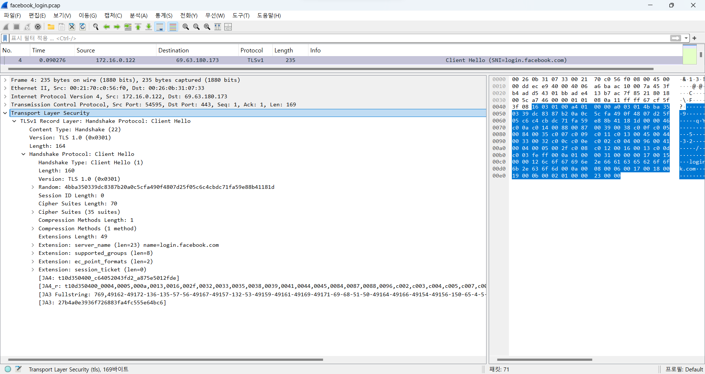
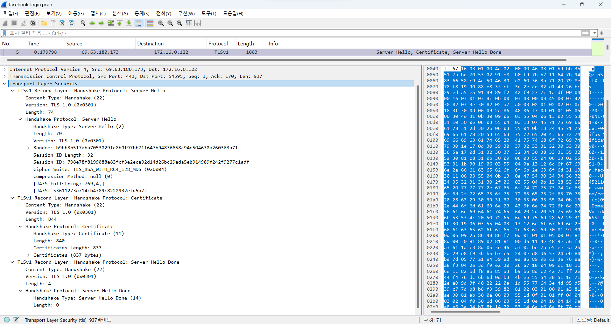
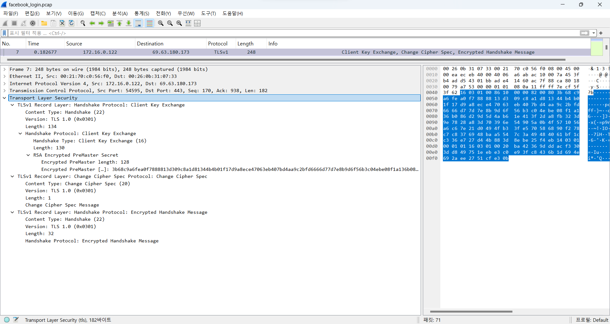
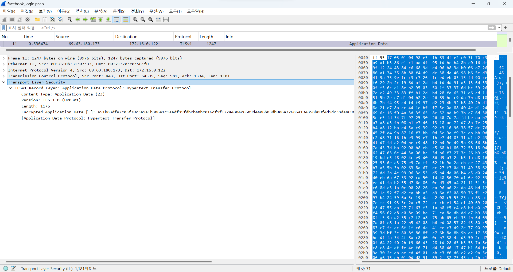
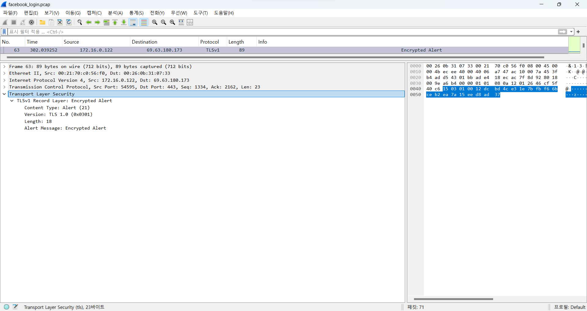

# SSL 패킷 분석을 통한 HTTPS 통신 흐름 이해 보고서

## 1. 과제 개요 및 목표
이 과제는 주어진 `facebook_login.pcap` 추적 파일을 Wireshark를 사용하여 분석하고, HTTPS 통신에서 SSL/TLS 핸드셰이크(Handshake) 과정을 단계별로 이해하고 설명하는 것을 목표로 하였다. 클라이언트와 서버 간에 암호화된 통신 채널이 어떻게 안전하게 수립되고 데이터가 교환되는지, 각 패킷이 어떤 정보를 담고 어떤 역할을 하는지 파악하는 데 중점을 두었다.

## 2. 문제 상황 및 요구사항 재확인
- **문제 상황** : `facebook_login.pcap` 파일을 통해 수집된 다수의 HTTPS 패킷에 대한 분석이 필요
- **요구사항** : `facebook_login.pcap` 추적 파일을 기반으로 SSL 패킷을 분석하고, 다음 SSL/TLS 핸드셰이크 흐름에 따라 각 단계를 상세히 설명
    1. Client Hello
    2. Server Hello
    3. Certificate
    4. Server Key Exchange (선택적)
    5. Certificate Request (선택적)
    6. Server Hello Done
    7. Certificate (클라이언트 측 - 상호 인증 시)
    8. Client Key Exchange
    9. Certificate Verify (클라이언트 측 - 상호 인증 시)
    10. Change CipherSpec (클라이언트)
    11. Finished (클라이언트)
    12. Change CipherSpec (서버)
    13. Finished (서버)

## 3. SSL/TLS 핸드셰이크 과정 상세 분석 (`facebook_login.pcap` 기반)
`facebook_login.pcap` 파일에서 `ssl` 필터링 시 나타나는 총 7개의 패킷(`4`, `5`, `7`, `8`, `9`, `11`, `63`)을 대상으로 SSL/TLS 핸드셰이크 단계를 분석하였다.

### 3.1. 사전 TCP 3-Way Handshake (패킷 1-3)
SSL/TLS 핸드셰이크가 시작되기 전에, 클라이언트(`172.16.0.122`)와 서버(`69.63.180.173`) 간에 TCP 연결이 먼저 수립된다.

- **패킷 1** (`SYN`): 클라이언트가 서버(`69.63.180.173`)의 `443`번 포트(HTTPS)로 `TCP SYN`(Synchronize) 패킷을 보내 연결을 요청한다.
- **패킷 2** (`SYN`, `ACK`): 서버가 클라이언트의 SYN에 대해 `SYN-ACK`(Synchronize-Acknowledgment) 패킷으로 응답하며 연결을 수락하고 자신의 SYN을 보낸다.
- **패킷 3** (`ACK`): 클라이언트가 서버의 `SYN-ACK`에 대해 `ACK`(Acknowledgment) 패킷으로 응답하며 **TCP 3-Way Handshake**를 완료하고 연결을 수립한다.

- **해석**: HTTPS 통신은 암호화된 HTTP 데이터를 전송하기 전에 먼저 안정적인 TCP 연결이 수립되어야 함을 보여준다.

### 3.2. SSL/TLS Handshake 단계별 분석
1. Client Hello (`Client Hello`)
- **해당 패킷**  : `4` (Source: `172.16.0.122`, Destination: `69.63.180.173`)
- **패킷 정보** : `TLSv1 Record Layer: Handshake Protocol: Client Hello`
- **설명** : TCP 연결이 수립된 후, 클라이언트(`172.16.0.122`)가 SSL/TLS 통신을 시작하기 위해 서버(`69.63.180.173`)에게 보내는 첫 번째 핸드셰이크 메시지이다. 이 패킷은 클라이언트가 지원하는 암호화 능력과 선호하는 옵션들을 서버에 알린다.
    - ``Version`` : 클라이언트가 제안하는 TLS 버전은 `TLS 1.0 (0x0301)`이다.
    - `Random` : `4bba350339dc8387b20a0c5cfa490f4807d25f05c6c4cbdc71fa59e88b41181d`는 32바이트 길이의 임의의 값으로, 이후 세션 키 생성에 사용될 클라이언트 랜덤(`Client Random`) 값이다.
    - `Cipher Suites` : 클라이언트가 지원하는 35가지 암호화 스위트(Cipher Suite) 목록이 포함되어 있다. 이 목록은 키 교환, 대칭 키 암호화, 해시 알고리즘 등의 조합으로, 클라이언트가 서버에 제안하는 암호화 통신 방법들이다.
    - `Compression Methods` : 1가지 압축 방식을 지원함을 명시한다.
    - **Extensions**
        - `server_name` : `login.facebook.com`이라는 **SNI(Server Name Indication)** 값을 통해 클라이언트가 접속하려는 실제 도메인 이름을 서버에게 알려준다. 이는 서버가 하나의 IP에서 여러 가상 호스트를 운영할 때 올바른 인증서를 제공하는 데 중요하다.
        - `supported_groups` : 클라이언트가 지원하는 타원 곡선 암호화(ECC) 그룹 목록이다.
        - `ec_point_formats` : 타원 곡선 포인트의 형식을 지정한다.
        - `session_ticket` : 세션 재개를 위한 TLS 세션 티켓 확장을 지원함을 나타낸다.
    - **해석** : 클라이언트의 초기 제안을 통해 가능한 암호화 옵션과 TLS 버전 협상의 시작을 알 수 있다.

2. Server Hello, 3. Certificate, 6. Server Hello Done
- **해당 패킷** : `5` (Source: `69.63.180.173`, Destination: `172.16.0.122`)
- **패킷 정보** : `TLSv1 Server Hello, Certificate, Server Hello Done`
- **설명** : `Client Hello`(패킷 4)에 대한 서버(`69.63.180.173`)의 응답 패킷이다. 이 단일 패킷에는 세 가지 핸드셰이크 메시지가 포함되어 있다.
    - `Server Hello` : 서버가 클라이언트의 제안을 받아들여 최종적으로 사용할 통신 방식을 결정하고 클라이언트에게 알리는 메시지이다.
        - `Version`: 서버도 `TLS 1.0 (0x0301)` 버전을 선택하여 통신할 것임을 명시했다.
        - `Random`: `b9bb3b517aba70530291e8b0f97bb711647b94836658c94c504630a260363a71`은 32바이트 길이의 임의의 값으로, 이후 세션 키 생성에 사용될 서버 랜덤(`Server Random`) 값이다.
        - `Session ID` : `798e78f8199088e83fcf3e2ece32d14d26bc29eda5eb914989f242f9277c1adf`는 32바이트 길이의 세션 ID로, 향후 클라이언트가 이 세션을 재사용하여 핸드셰이크 과정을 단축시키는 데 활용될 수 있다.
        - `Cipher Suite` : 서버는 클라이언트의 35가지 제안 중 `TLS_RSA_WITH_RC4_128_MD5 (0x0004)`를 최종 암호화 스위트로 선택했다. 이는 키 교환에 RSA, 대칭 암호화에 RC4-128, 메시지 무결성 검증에 MD5를 사용할 것을 의미한다.
        - `Compression Method` : `null (0)`로, 압축을 사용하지 않음을 나타낸다.
    - `Certificate` : 서버는 자신의 신원을 증명하기 위해 디지털 인증서를 클라이언트에게 전송한다. 제공된 정보에 따르면 837바이트 길이의 인증서 정보가 포함되어 있다. 이 인증서에는 `login.facebook.com`과 같은 서버의 도메인 이름, 서버의 공개 키, 인증서 발급자(CA), 유효 기간, 서명 정보 등이 포함되어 클라이언트가 서버의 신뢰성을 검증할 수 있도록 한다.
    - `Server Hello Done` : 서버가 핸드셰이크의 초기 협상 및 인증서 제공 단계를 모두 완료했으며, 이제 클라이언트가 다음 단계를 진행할 차례임을 알리는 메시지이다.
- **해석** : 서버가 클라이언트의 제안을 받아들여 통신 방식을 (`TLS_RSA_WITH_RC4_128_MD5`로) 확정하고, 자신의 신원을 인증서로 증명하여 클라이언트가 서버를 신뢰할 수 있는 기반을 마련한다. `TLS_RSA_WITH_RC4_128_MD5`의 선택은 해당 `pcap` 파일이 비교적 오래된 통신을 담고 있음을 시사한다.

4. Server Key Exchange 및 5. Certificate Request
- **해당 패킷** : 주어진 `facebook_login.pcap` 파일의 패킷 목록에서는 이 단계들이 별도의 SSL/TLS 핸드셰이크 메시지로 명시적으로 나타나지 않는다.
- **설명**
    - `Server Key Exchange` : 이 패킷은 `ECDHE`나 `DHE`와 같이 임시 키 교환 방식을 사용할 때 서버가 자신의 임시 공개 키 파라미터를 전송하는 단계이다. 이 통신에서는 서버가 `TLS_RSA_WITH_RC4_128_MD5`를 선택했으므로, 키 교환에 RSA를 사용한다. RSA 키 교환 방식에서는 서버 인증서에 포함된 공개 키를 바로 사용하므로, 별도의 `Server Key Exchange` 메시지가 필요 없다.
    - `Certificate Request`: 이 패킷은 서버가 클라이언트에게도 자신의 신원을 증명하기 위한 인증서를 요청할 때 사용된다 (상호 인증). 일반적인 웹 서비스 로그인에서는 드물게 사용되며, 이 `pcap` 파일에서도 발생하지 않았다.
- **해석** : 패킷이 관찰되지 않는 것은 사용된 암호화 스위트(`TLS_RSA_WITH_RC4_128_MD5`)와 인증 방식에 따라 특정 핸드셰이크 단계가 생략될 수 있음을 보여준다.

8. Client Key Exchange, 9. Certificate Verify, 10. Change CipherSpec (클라이언트), 11. Finished (클라이언트)
- **해당 패킷** : `7` (Source: `172.16.0.122`, Destination: `69.63.180.173`)
- **패킷 정보**: `TLSv1 Client Key Exchange, Change Cipher Spec, Encrypted Handshake Message`
- **설명** : 이 패킷은 클라이언트(`172.16.0.122`)가 서버(`69.63.180.173`)에게 보내는 세 가지 중요한 메시지(`Client Key Exchange`, `Change Cipher Spec`, `Finished`)를 포함한다.
    - `Client Key Exchange` : 클라이언트는 서버와 실제 데이터를 암호화/복호화할 대칭 세션 키를 생성하는 데 필요한 핵심 정보를 전송한다. 서버가 `TLS_RSA_WITH_RC4_128_MD5`를 선택했으므로, 클라이언트는 RSA 암호화 방식을 사용하여 `Pre-Master Secret`를 생성하고 이를 서버의 공개 키(서버 인증서에서 추출)로 암호화하여 전송한다.
        - `RSA Encrypted PreMaster Secret`: `3b68c9a6fe...baa5`와 같은 128바이트 길이의 암호화된 데이터가 포함되어 있다. 이 데이터는 클라이언트가 생성한 Pre-Master Secret이며, 서버만이 자신의 개인 키로 이를 해독할 수 있다.
        - 복호화된 `Pre-Master Secret`와 `Client Random` (`패킷 4`), `Server Random` (`패킷 5`)이 결합되어 최종적으로 **대칭 세션 키(Symmetric Session Key)**가 생성된다. 이 세션 키는 이후 모든 실제 데이터 통신을 암호화하고 복호화하는 데 사용된다.
    - `Certificate Verify` : 이 `pcap` 파일에서는 클라이언트 인증서 요청(`Certificate Request`)이 없었으므로, 클라이언트가 자신을 인증할 필요가 없어 이 단계는 발생하지 않았다.
    - `Change CipherSpec` (클라이언트) : 클라이언트가 서버에게 "이제부터 주고받는 모든 데이터는 방금 합의된 암호화 알고리즘과 생성된 세션 키를 사용하여 암호화될 것이다"라고 알리는 신호이다. `Content Type: Change Cipher Spec (20)`과 `Length: 1`이 이를 명확히 보여준다. 이 메시지 자체는 암호화되지 않는다.
    - `Encrypted Handshake Message` (Finished) (클라이언트) : 클라이언트가 핸드셰이크 과정에서 교환된 모든 메시지들의 해시 값을 계산한 후, 이를 새롭게 생성된 대칭 세션 키로 암호화하여 서버에게 전송하는 메시지이다. `Content Type: Handshake (22)`이지만 암호화되어 있어 Wireshark에서 `Encrypted Handshake Message`로 표시된다. 서버는 이 메시지를 복호화하고 해시 값을 검증하여 핸드셰이크 과정의 무결성(어떤 변조도 없었음)을 최종 확인한다.
- **해석** : 이 패킷은 SSL/TLS 핸드셰이크의 가장 중요한 단계 중 하나로, **세션 키의 안전한 교환(RSA 암호화 기반)**이 이루어지고, 클라이언트가 암호화된 통신으로 전환할 준비를 완료했음을 서버에 알리는 역할을 한다.

12. Change CipherSpec (서버), 13. Finished (서버)
- **해당 패킷** : `8` (Source: `69.63.180.173`, Destination: `172.16.0.122`)
- **패킷 정보** : `TLSv1 Change Cipher Spec, Encrypted Handshake Message`
- **설명** : 클라이언트의 `Client Key Exchange` 및 `Change Cipher Spec` 메시지(`패킷 7`)에 대한 서버(`69.63.180.173`)의 응답으로, 서버 또한 암호화된 통신으로 전환하고 핸드셰이크를 최종적으로 완료했음을 알리는 메시지들을 포함한다.
    - `Change CipherSpec` (서버) : 서버가 "이제부터 주고받는 모든 데이터는 방금 합의된 암호화 알고리즘과 생성된 세션 키를 사용하여 암호화될 것이다"라고 클라이언트에게 알리는 신호이다. `Content Type: Change Cipher Spec (20)`과 `Length: 1`이 이를 나타내며, 이 메시지 자체는 암호화되지 않는다.
    - `Encrypted Handshake Message` (Finished) (서버) : 서버가 핸드셰이크의 모든 메시지들의 해시 값을 계산한 후, 이를 새롭게 생성된 대칭 세션 키로 암호화하여 클라이언트에게 전송하는 메시지이다. `Content Type: Handshake (22)`이지만 실제 내용은 암호화되어 `Encrypted Handshake Message`로 표시된다. 클라이언트는 이 메시지를 복호화하고 해시 값을 검증하여 핸드셰이크 과정의 **무결성(데이터 변조 없음)**을 최종적으로 확인한다. 이 단계가 성공적으로 완료되면 클라이언트와 서버 모두 암호화된 통신을 시작할 준비가 완료된다.
- **해석** : 이 패킷은 서버가 암호화 통신 모드로 성공적으로 전환했으며, SSL/TLS 핸드셰이크가 안전하고 무결하게 완료되었음을 양측이 최종적으로 확인하는 중요한 마지막 단계이다. 이제 실제 애플리케이션 데이터(HTTPS) 전송이 가능해진다.

### 3.3. 암호화된 애플리케이션 데이터 전송
- **해당 패킷** : `9` (Source: `172.16.0.122`, Destination: `69.63.180.173`), `11` (Source: `69.63.180.173`, Destination: `172.16.0.122`)
- **패킷 정보** : `TLSv1 Record Layer: Application Data Protocol: Hypertext Transfer Protocol`
- **설명** : 패킷 8번(서버의 `Finished`) 이후부터는 클라이언트와 서버 간의 SSL/TLS 핸드셰이크가 성공적으로 완료되었음을 의미한다. 이제부터 실제 애플리케이션 데이터(HTTPS 요청/응답)가 합의된 대칭 세션 키와 암호화 알고리즘(`TLS_RSA_WITH_RC4_128_MD5`)을 사용하여 완전히 암호화되어 전송된다. Wireshark에서는 이 데이터의 내용을 직접 해독할 수 없으며, `Application Data` 또는 `Encrypted Application Data`로 표시된다.
    - **패킷 9** : 클라이언트가 서버로 전송하는 암호화된 `Application Data`이다. (`Length: 977`) 이는 로그인 정보와 같은 HTTP 요청 데이터일 가능성이 높다.
    - **패킷 11** : 서버가 클라이언트로 전송하는 암호화된 `Application Data`이다. (`Length: 1176`) 이는 클라이언트의 요청에 대한 HTTP 응답 데이터(예: 로그인 성공 후의 Facebook 홈 페이지 콘텐츠)일 가능성이 높다.
    - `Content Type` : 두 패킷 모두 `Application Data (23)`로, 실제 사용자 데이터임을 나타낸다.
    - `[Application Data Protocol: Hypertext Transfer Protocol]` : Wireshark가 이 암호화된 데이터가 HTTPS 통신의 HTTP 부분임을 식별하고 있다.
- **해석** : 이 패킷들은 SSL/TLS 핸드셰이크를 통해 구축된 안전한 통신 채널을 통해 실제 사용자 데이터가 암호화된 상태로 양방향으로 전달되고 있음을 증명하며, 데이터의 기밀성이 성공적으로 보장되고 있음을 보여준다.

### 3.4. TLS 연결 종료
- **해당 패킷** : `63` (Source: `172.16.0.122`, Destination: `69.63.180.173`)
- **패킷 정보** : `TLSv1 Record Layer: Encrypted Alert`
- **설명** : 이 패킷은 SSL/TLS 세션의 종료를 알리는 메시지이다. 클라이언트(`172.16.0.122`)가 서버(`69.63.180.173`)에게 전송한 것으로, 일반적으로 세션 종료를 알리는 `close_notify` (종료 알림) 메시지가 암호화되어 전송될 때 다음과 같이 표시된다.
    - `Content Type` : `Alert (21)`로, TLS 프로토콜 내에서 경고 또는 종료 메시지임을 나타낸다.
    - `Version` : `TLS 1.0 (0x0301)` 버전이 사용되고 있다.
    - `Alert Message: Encrypted Alert` : 이 경고 메시지는 암호화된 상태로 전송된다. 이는 TLS 세션이 종료될 때도 보안을 유지하기 위함이다.
- **해석** : 안전한 통신이 끝날 때도 암호화된 경고 메시지를 통해 세션 종료를 알림으로써, 통신 전반의 보안 무결성을 유지하는 TLS의 특징을 보여준다. 이후에는 TCP `FIN/ACK` 패킷을 통해 하위 계층인 TCP 연결도 종료된다.

## 4. 결론
주어진 `facebook_login.pcap` 파일의 SSL/TLS 패킷 분석을 통해 HTTPS 통신이 어떻게 안전하게 수립되고 유지되는지 명확히 이해할 수 있었다.

1. **초기 협상** : `Client Hello`와 `Server Hello`를 통해 클라이언트와 서버는 지원하는 TLS 버전과 암호화 스위트(`TLS_RSA_WITH_RC4_128_MD5`)를 교환하고, 사용할 최종 암호화 방식을 합의한다. 이 과정에서 각자의 랜덤 값을 생성하여 이후 세션 키 생성에 활용한다.
2. **서버 인증 및 키 교환** : 서버는 `Certificate` 메시지를 통해 자신의 신원을 인증서로 증명하고 공개 키를 클라이언트에게 제공한다. 클라이언트는 이 공개 키를 사용하여 `Client Key Exchange` 메시지 내의 `Pre-Master Secret`를 암호화하여 전송함으로써, 대칭 세션 키를 안전하게 교환한다. 이 `pcap` 파일에서는 `Server Key Exchange`나 `Certificate Request`와 같은 선택적 단계는 발생하지 않아, Facebook 로그인과 같은 일반적인 HTTPS 통신에서는 상호 인증이나 특정 키 교환 방식이 필수는 아님을 알 수 있었다.
3. **암호화 통신 시작** : `Change CipherSpec` 메시지를 통해 양측은 이제부터 모든 통신이 합의된 대칭 세션 키를 사용하여 암호화될 것임을 알린다. `Finished` 메시지를 통해 핸드셰이크 과정의 무결성을 최종 검증하며, 이후부터는 `Application Data` 형태로 실제 HTTP 트래픽이 암호화되어 안전하게 전송된다.
4. **보안 종료** : 통신이 끝날 때도 `Encrypted Alert`를 통해 암호화된 상태로 세션 종료를 알림으로써, 통신 전반의 보안 무결성을 유지한다.

이러한 SSL/TLS 핸드셰이크 과정은 웹 브라우징, 온라인 뱅킹, 로그인 등 민감한 정보가 오가는 모든 인터넷 통신에서 데이터의 기밀성, 무결성, 그리고 송수신자 간의 인증을 보장하는 핵심적인 보안 메커니즘임을 확인할 수 있었다. 특히, 이 `pcap` 파일에서는 `TLS_RSA_WITH_RC4_128_MD5`라는 비교적 오래된 암호화 스위트가 사용되었음이 관찰되었다.